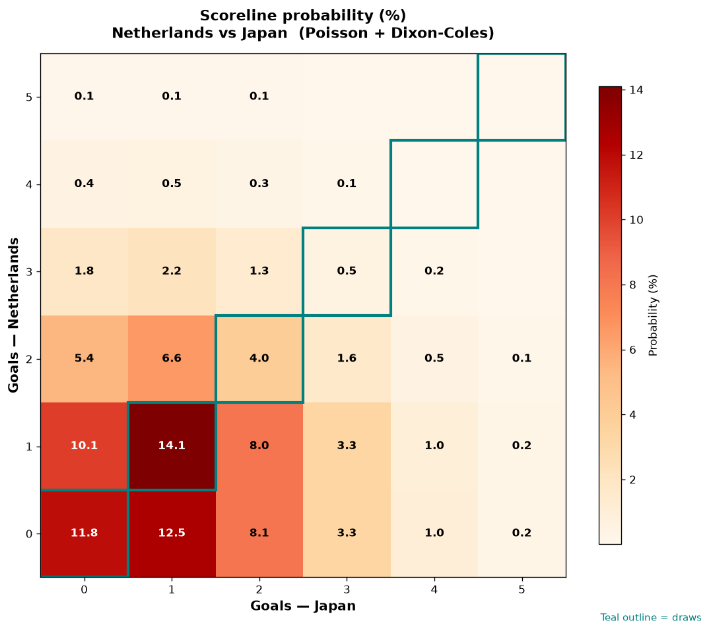

# Netherlands vs Japan — 2026-06-14

*Stage:* group  ·  *Engine:* Poisson bivariate + Dixon-Coles + Monte Carlo

## Expected goals (model)

- **Netherlands**: 0.99
- **Japan**: 1.21
- **Total**: 2.21  ·  rho = -0.0633

## 1X2 (match result)

| Outcome | Model |
|---|---|
| Netherlands win | **29.2%** |
| Draw | **30.5%** |
| Japan win | **40.2%** |

*Monte Carlo (200,000 sims):* 29.2% / 30.5% / 40.3% · avg goals 2.21

## Most likely scorelines

- 1-1: 14.1%
- 0-1: 12.5%
- 0-0: 11.8%
- 1-0: 10.1%
- 0-2: 8.1%
- 1-2: 8.0%

## Derived markets

- Both teams to score: 45.1%
- Over 2.5 goals: 37.9%  ·  Under 2.5: 62.1%
- Double chance 1X: 59.8%  ·  X2: 70.8%

## Model vs market (de-margined)

| Outcome | Model | Market | Blend |
|---|---|---|---|
| Netherlands | 29.2% | 47.0% | 29.2% |
| Draw | 30.5% | 26.4% | 30.5% |
| Japan | 40.2% | 26.5% | 40.2% |

*Overround: 1.042  ·  blend weight: 0.0*

## Scoreline heatmap

---
*Informational model output — not betting advice.*