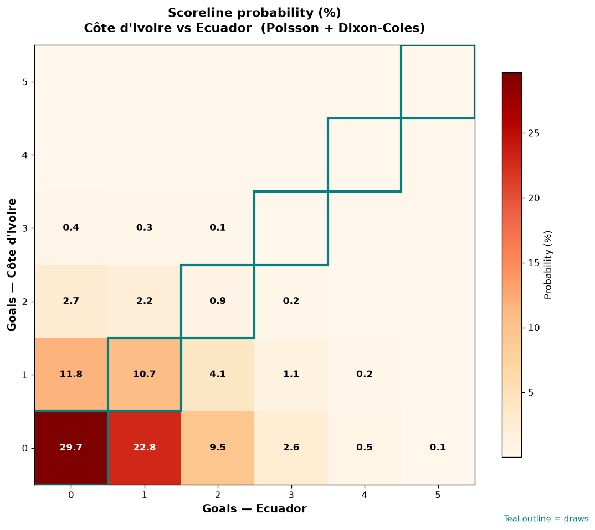

# Côte d'Ivoire vs Ecuador — 2026-06-14

*Stage:* group  ·  *Engine:* Poisson bivariate + Dixon-Coles + Monte Carlo

## Expected goals (model)

- **Côte d'Ivoire**: 0.43
- **Ecuador**: 0.81
- **Total**: 1.24  ·  rho = -0.0633

## 1X2 (match result)

| Outcome | Model |
|---|---|
| Côte d'Ivoire win | **17.5%** |
| Draw | **41.3%** |
| Ecuador win | **41.2%** |

*Monte Carlo (50,000 sims):* 17.7% / 41.3% / 41.0% · avg goals 1.24

## Most likely scorelines

- 0-0: 29.7%
- 0-1: 22.8%
- 1-0: 11.8%
- 1-1: 10.7%
- 0-2: 9.5%
- 1-2: 4.1%

## Derived markets

- Both teams to score: 20.0%
- Over 2.5 goals: 12.9%  ·  Under 2.5: 87.1%
- Double chance 1X: 58.8%  ·  X2: 82.5%

## Scoreline heatmap

---
*Informational model output — not betting advice.*