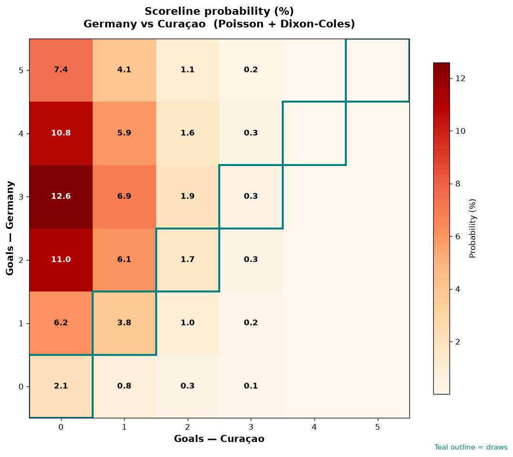

# Germany vs Curaçao — 2026-06-14

*Stage:* group  ·  *Engine:* Poisson bivariate + Dixon-Coles + Monte Carlo

## Expected goals (model)

- **Germany**: 3.42
- **Curaçao**: 0.55
- **Total**: 3.97  ·  rho = -0.0633

## 1X2 (match result)

| Outcome | Model |
|---|---|
| Germany win | **89.3%** |
| Draw | **7.9%** |
| Curaçao win | **2.7%** |

*Monte Carlo (50,000 sims):* 89.3% / 8.0% / 2.7% · avg goals 3.97

## Most likely scorelines

- 3-0: 12.6%
- 2-0: 11.0%
- 4-0: 10.8%
- 5-0: 7.4%
- 3-1: 6.9%
- 1-0: 6.2%

## Derived markets

- Both teams to score: 41.1%
- Over 2.5 goals: 75.8%  ·  Under 2.5: 24.2%
- Double chance 1X: 97.3%  ·  X2: 10.7%

## Scoreline heatmap

---
*Informational model output — not betting advice.*