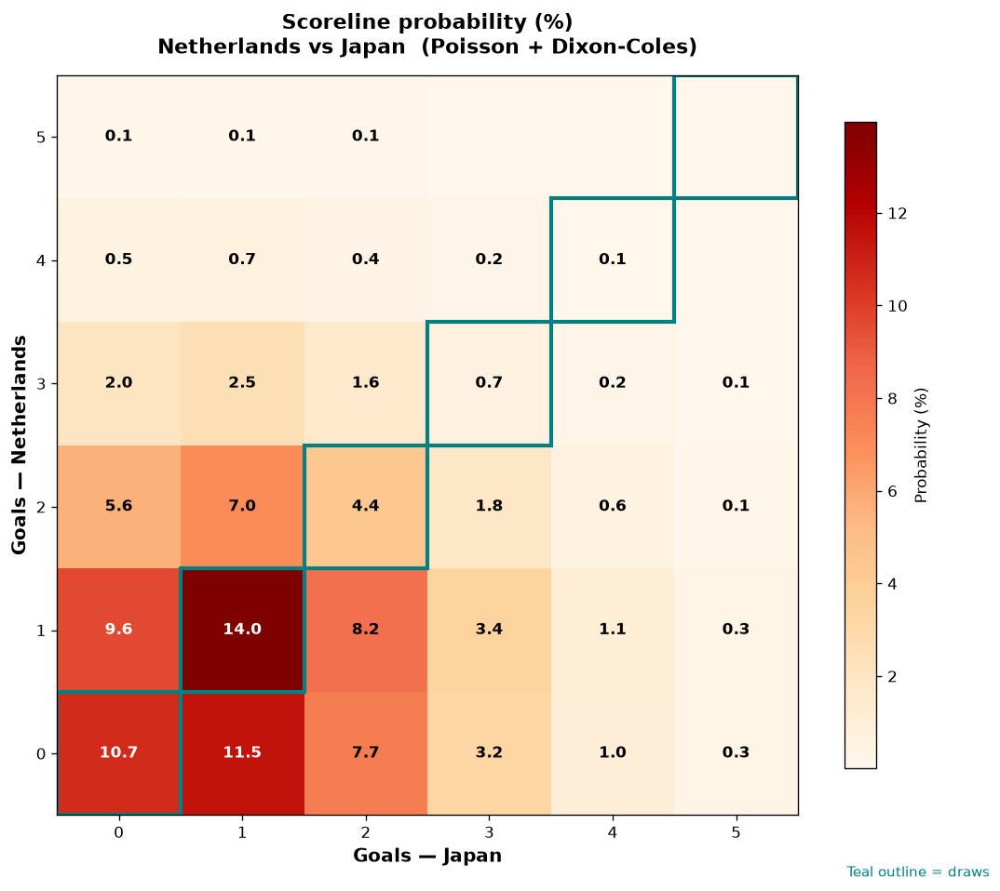

# Netherlands vs Japan — 2026-06-14

*Stage:* group  ·  *Engine:* Poisson bivariate + Dixon-Coles + Monte Carlo

## Expected goals (model)

- **Netherlands**: 1.07
- **Japan**: 1.25
- **Total**: 2.32  ·  rho = -0.0633

## 1X2 (match result)

| Outcome | Model |
|---|---|
| Netherlands win | **30.5%** |
| Draw | **29.7%** |
| Japan win | **39.8%** |

*Monte Carlo (50,000 sims):* 30.7% / 29.5% / 39.8% · avg goals 2.32

## Most likely scorelines

- 1-1: 14.0%
- 0-1: 11.5%
- 0-0: 10.7%
- 1-0: 9.6%
- 1-2: 8.2%
- 0-2: 7.7%

## Derived markets

- Both teams to score: 47.7%
- Over 2.5 goals: 40.9%  ·  Under 2.5: 59.1%
- Double chance 1X: 60.2%  ·  X2: 69.5%

## Scoreline heatmap

---
*Informational model output — not betting advice.*