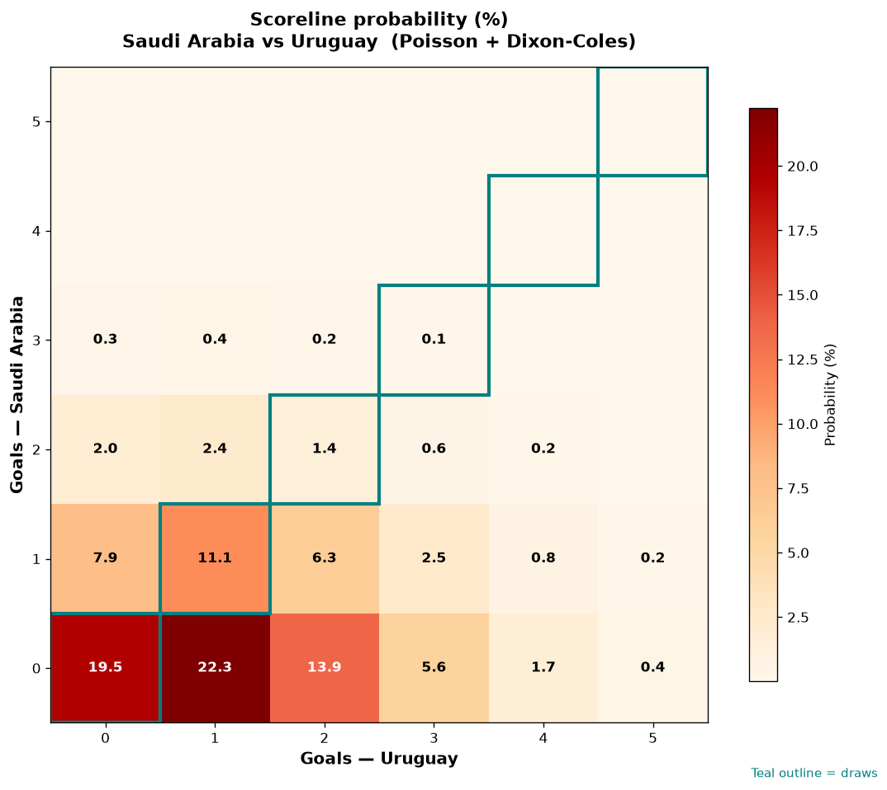

# Saudi Arabia vs Uruguay — 2026-06-15

*Stage:* group  ·  *Engine:* Poisson bivariate + Dixon-Coles + Monte Carlo

## Expected goals (model)

- **Saudi Arabia**: 0.45
- **Uruguay**: 1.21
- **Total**: 1.67  ·  rho = -0.0619

## 1X2 (match result)

| Outcome | Model |
|---|---|
| Saudi Arabia win | **13.3%** |
| Draw | **32.1%** |
| Uruguay win | **54.6%** |

*Monte Carlo (50,000 sims):* 13.3% / 32.3% / 54.4% · avg goals 1.67

## Most likely scorelines

- 0-1: 22.3%
- 0-0: 19.5%
- 0-2: 13.9%
- 1-1: 11.1%
- 1-0: 7.9%
- 1-2: 6.3%

## Derived markets

- Both teams to score: 26.3%
- Over 2.5 goals: 23.4%  ·  Under 2.5: 76.6%
- Double chance 1X: 45.4%  ·  X2: 86.7%

## Scoreline heatmap

---
*Informational model output — not betting advice.*