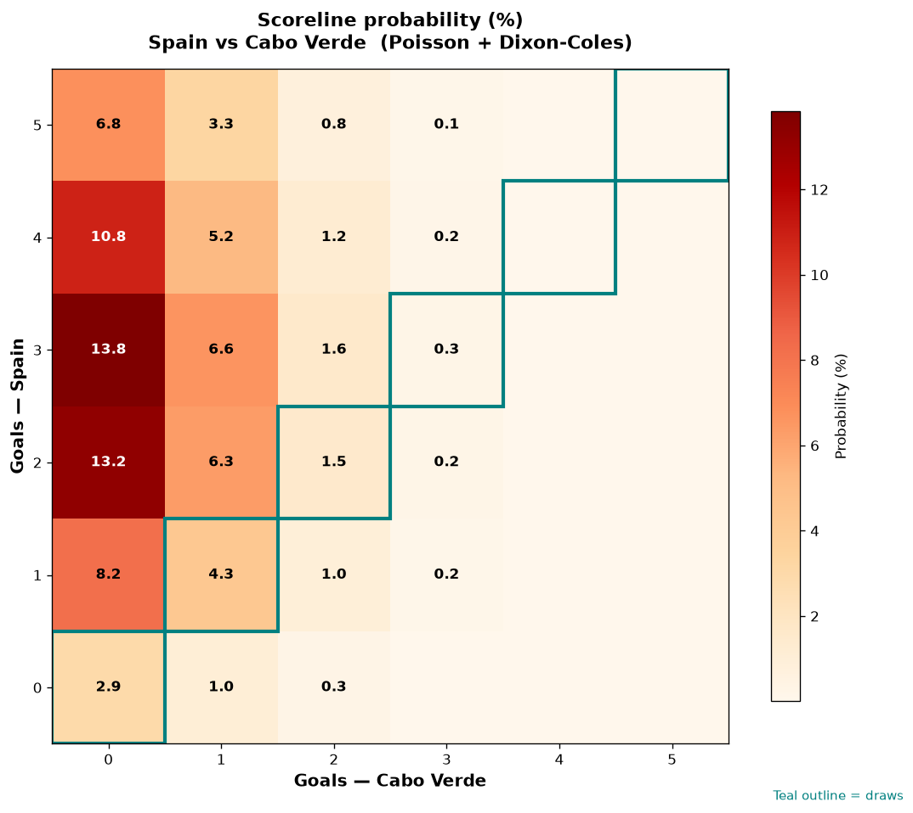

# Spain vs Cabo Verde — 2026-06-15

*Stage:* group  ·  *Engine:* Poisson bivariate + Dixon-Coles + Monte Carlo

## Expected goals (model)

- **Spain**: 3.14
- **Cabo Verde**: 0.48
- **Total**: 3.61  ·  rho = -0.0619

## 1X2 (match result)

| Outcome | Model |
|---|---|
| Spain win | **88.1%** |
| Draw | **9.0%** |
| Cabo Verde win | **2.9%** |

*Monte Carlo (50,000 sims):* 88.1% / 9.0% / 2.9% · avg goals 3.62

## Most likely scorelines

- 3-0: 13.8%
- 2-0: 13.2%
- 4-0: 10.8%
- 1-0: 8.2%
- 5-0: 6.8%
- 3-1: 6.6%

## Derived markets

- Both teams to score: 36.7%
- Over 2.5 goals: 70.0%  ·  Under 2.5: 30.0%
- Double chance 1X: 97.1%  ·  X2: 11.9%

## Scoreline heatmap

---
*Informational model output — not betting advice.*