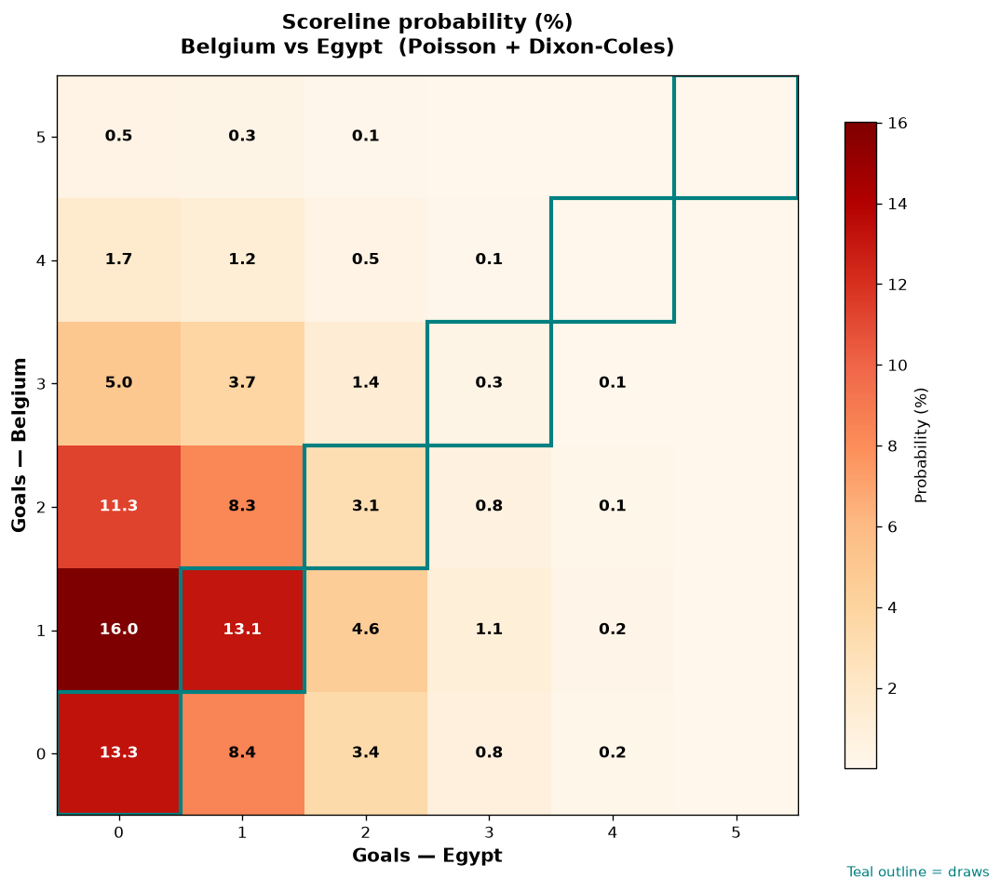

# Belgium vs Egypt — 2026-06-15

*Stage:* group  ·  *Engine:* Poisson bivariate + Dixon-Coles + Monte Carlo

## Expected goals (model)

- **Belgium**: 1.34
- **Egypt**: 0.74
- **Total**: 2.08  ·  rho = -0.0619

## 1X2 (match result)

| Outcome | Model |
|---|---|
| Belgium win | **50.5%** |
| Draw | **29.8%** |
| Egypt win | **19.7%** |

*Monte Carlo (50,000 sims):* 50.5% / 29.7% / 19.8% · avg goals 2.09

## Most likely scorelines

- 1-0: 16.0%
- 0-0: 13.3%
- 1-1: 13.1%
- 2-0: 11.3%
- 0-1: 8.4%
- 2-1: 8.3%

## Derived markets

- Both teams to score: 39.3%
- Over 2.5 goals: 34.5%  ·  Under 2.5: 65.5%
- Double chance 1X: 80.3%  ·  X2: 49.5%

## Scoreline heatmap

---
*Informational model output — not betting advice.*