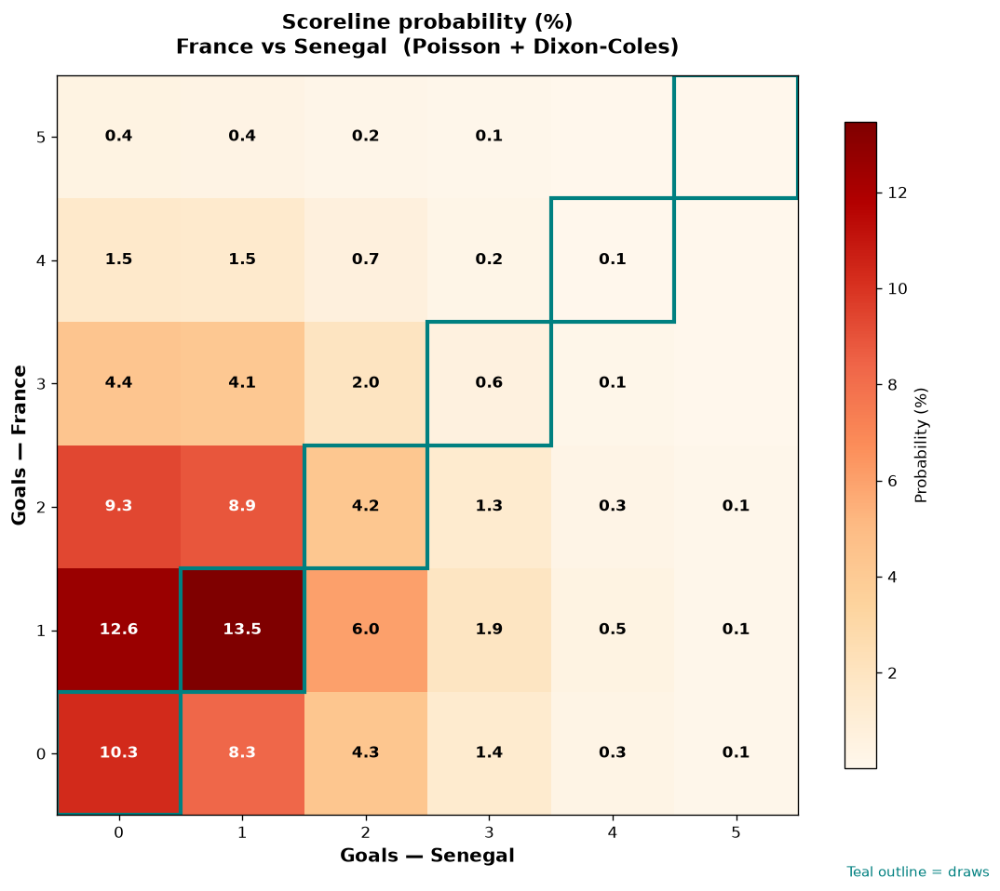

# France vs Senegal — 2026-06-16

*Stage:* group  ·  *Engine:* Poisson bivariate + Dixon-Coles + Monte Carlo

## Expected goals (model)

- **France**: 1.40
- **Senegal**: 0.95
- **Total**: 2.35  ·  rho = -0.0619

## 1X2 (match result)

| Outcome | Model |
|---|---|
| France win | **46.6%** |
| Draw | **28.7%** |
| Senegal win | **24.7%** |

*Monte Carlo (50,000 sims):* 46.6% / 28.6% / 24.8% · avg goals 2.36

## Most likely scorelines

- 1-1: 13.5%
- 1-0: 12.6%
- 0-0: 10.3%
- 2-0: 9.3%
- 2-1: 8.9%
- 0-1: 8.3%

## Derived markets

- Both teams to score: 47.0%
- Over 2.5 goals: 41.8%  ·  Under 2.5: 58.2%
- Double chance 1X: 75.3%  ·  X2: 53.4%

## Scoreline heatmap

---
*Informational model output — not betting advice.*