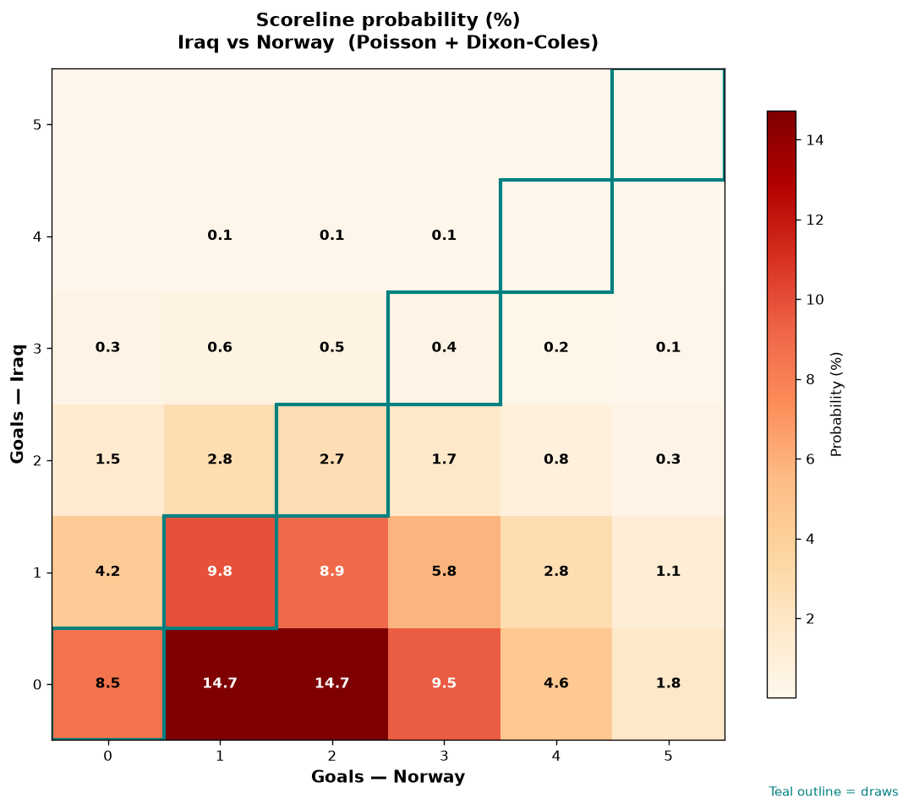

# Iraq vs Norway — 2026-06-16

*Stage:* group  ·  *Engine:* Poisson bivariate + Dixon-Coles + Monte Carlo

## Expected goals (model)

- **Iraq**: 0.61
- **Norway**: 1.93
- **Total**: 2.54  ·  rho = -0.0619

## 1X2 (match result)

| Outcome | Model |
|---|---|
| Iraq win | **10.2%** |
| Draw | **21.4%** |
| Norway win | **68.4%** |

*Monte Carlo (50,000 sims):* 10.0% / 21.6% / 68.5% · avg goals 2.54

## Most likely scorelines

- 0-2: 14.7%
- 0-1: 14.7%
- 1-1: 9.8%
- 0-3: 9.5%
- 1-2: 8.9%
- 0-0: 8.5%

## Derived markets

- Both teams to score: 39.5%
- Over 2.5 goals: 46.6%  ·  Under 2.5: 53.4%
- Double chance 1X: 31.6%  ·  X2: 89.8%

## Scoreline heatmap

---
*Informational model output — not betting advice.*