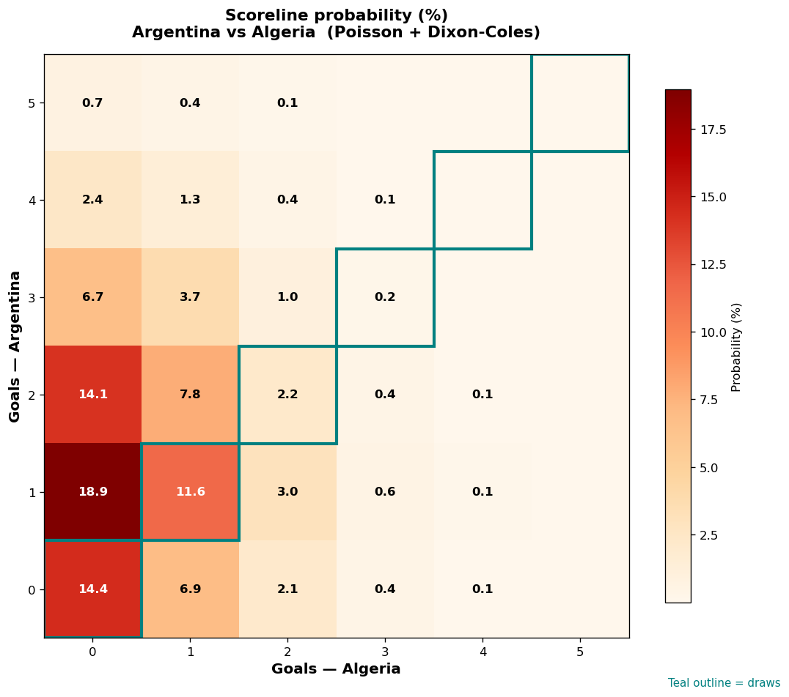

# Argentina vs Algeria — 2026-06-17

*Stage:* group  ·  *Engine:* Poisson bivariate + Dixon-Coles + Monte Carlo

## Expected goals (model)

- **Argentina**: 1.43
- **Algeria**: 0.56
- **Total**: 1.99  ·  rho = -0.0619

## 1X2 (match result)

| Outcome | Model |
|---|---|
| Argentina win | **58.1%** |
| Draw | **28.3%** |
| Algeria win | **13.7%** |

*Monte Carlo (2,000 sims):* 57.5% / 28.4% / 14.1% · avg goals 2.01

## Most likely scorelines

- 1-0: 18.9%
- 0-0: 14.4%
- 2-0: 14.1%
- 1-1: 11.6%
- 2-1: 7.8%
- 0-1: 6.9%

## Derived markets

- Both teams to score: 33.1%
- Over 2.5 goals: 32.0%  ·  Under 2.5: 68.0%
- Double chance 1X: 86.3%  ·  X2: 41.9%

## Scoreline heatmap

---
*Informational model output — not betting advice.*