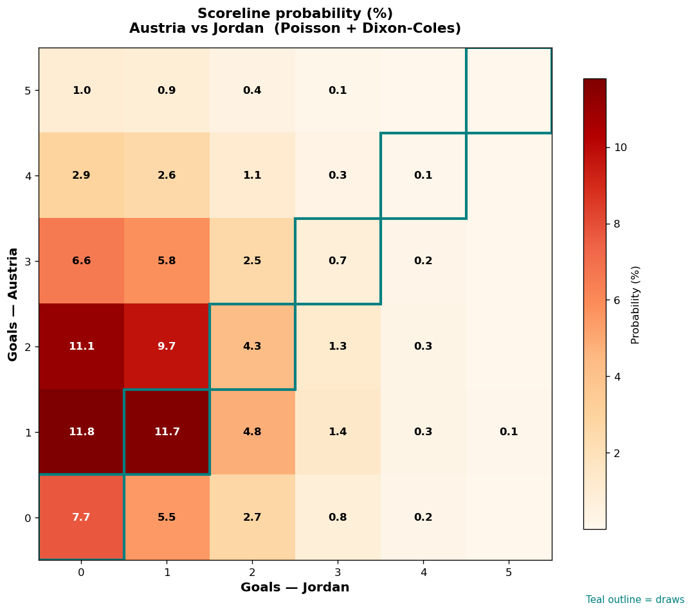

# Austria vs Jordan — 2026-06-17

*Stage:* group  ·  *Engine:* Poisson bivariate + Dixon-Coles + Monte Carlo

## Expected goals (model)

- **Austria**: 1.78
- **Jordan**: 0.88
- **Total**: 2.66  ·  rho = -0.0619

## 1X2 (match result)

| Outcome | Model |
|---|---|
| Austria win | **57.9%** |
| Draw | **24.5%** |
| Jordan win | **17.7%** |

*Monte Carlo (2,000 sims):* 59.0% / 21.9% / 19.1% · avg goals 2.69

## Most likely scorelines

- 1-0: 11.8%
- 1-1: 11.7%
- 2-0: 11.1%
- 2-1: 9.7%
- 0-0: 7.7%
- 3-0: 6.6%

## Derived markets

- Both teams to score: 49.3%
- Over 2.5 goals: 49.6%  ·  Under 2.5: 50.4%
- Double chance 1X: 82.3%  ·  X2: 42.1%

## Scoreline heatmap

---
*Informational model output — not betting advice.*