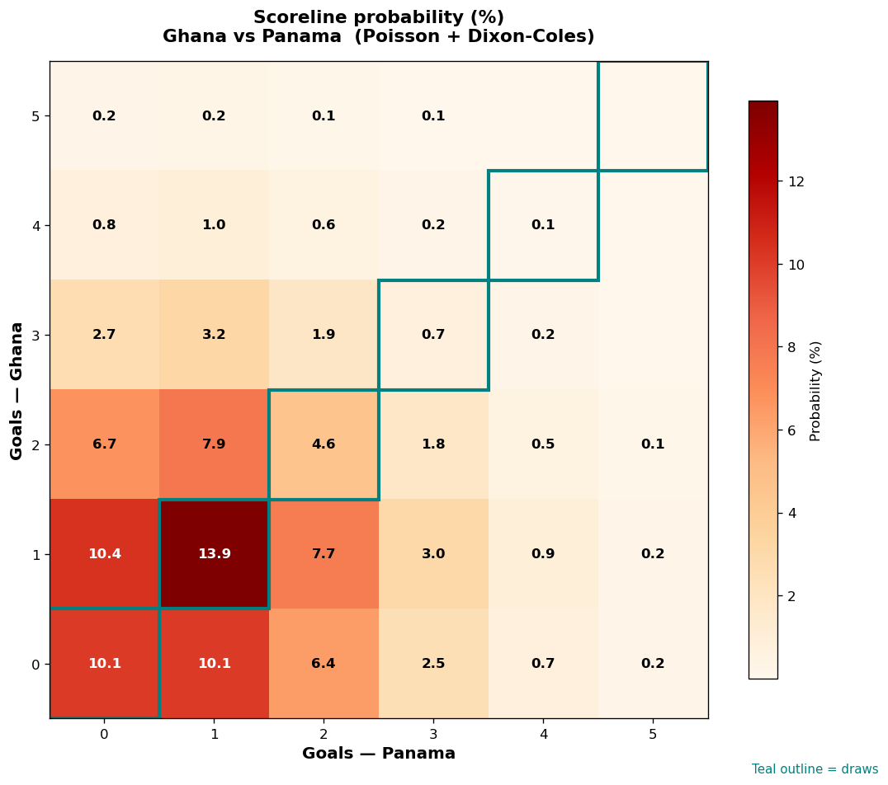

# Ghana vs Panama — 2026-06-17

*Stage:* group  ·  *Engine:* Poisson bivariate + Dixon-Coles + Monte Carlo

## Expected goals (model)

- **Ghana**: 1.20
- **Panama**: 1.17
- **Total**: 2.38  ·  rho = -0.0619

## 1X2 (match result)

| Outcome | Model |
|---|---|
| Ghana win | **36.0%** |
| Draw | **29.4%** |
| Panama win | **34.5%** |

*Monte Carlo (2,000 sims):* 35.5% / 29.6% / 34.8% · avg goals 2.40

## Most likely scorelines

- 1-1: 13.9%
- 1-0: 10.4%
- 0-0: 10.1%
- 0-1: 10.1%
- 2-1: 7.9%
- 1-2: 7.7%

## Derived markets

- Both teams to score: 49.1%
- Over 2.5 goals: 42.4%  ·  Under 2.5: 57.6%
- Double chance 1X: 65.5%  ·  X2: 64.0%

## Scoreline heatmap

---
*Informational model output — not betting advice.*