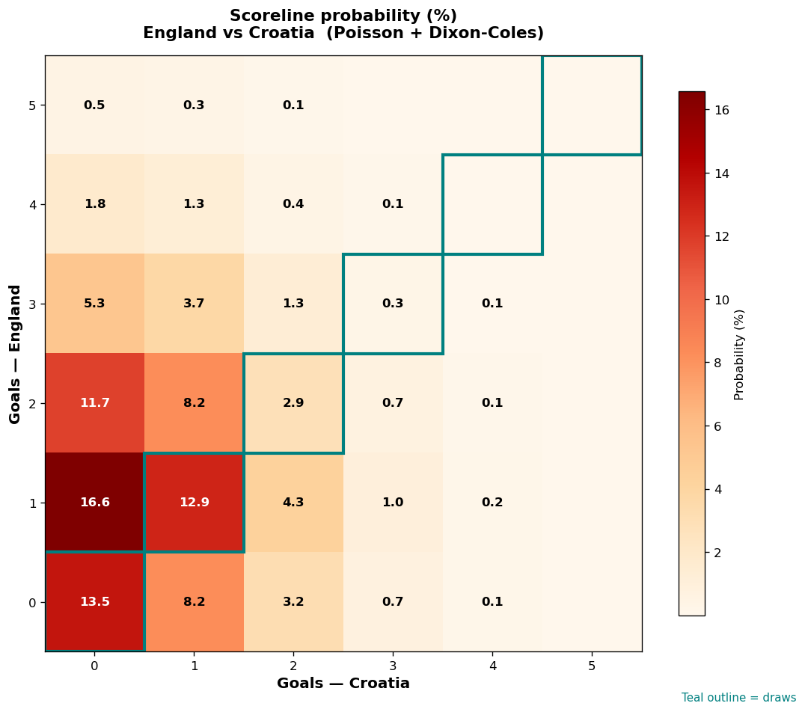

# England vs Croatia — 2026-06-17

*Stage:* group  ·  *Engine:* Poisson bivariate + Dixon-Coles + Monte Carlo

## Expected goals (model)

- **England**: 1.35
- **Croatia**: 0.70
- **Total**: 2.06  ·  rho = -0.0619

## 1X2 (match result)

| Outcome | Model |
|---|---|
| England win | **51.7%** |
| Draw | **29.7%** |
| Croatia win | **18.7%** |

*Monte Carlo (2,000 sims):* 51.3% / 29.3% / 19.4% · avg goals 2.08

## Most likely scorelines

- 1-0: 16.6%
- 0-0: 13.5%
- 1-1: 12.9%
- 2-0: 11.7%
- 0-1: 8.2%
- 2-1: 8.2%

## Derived markets

- Both teams to score: 38.2%
- Over 2.5 goals: 33.8%  ·  Under 2.5: 66.2%
- Double chance 1X: 81.3%  ·  X2: 48.3%

## Scoreline heatmap

---
*Informational model output — not betting advice.*