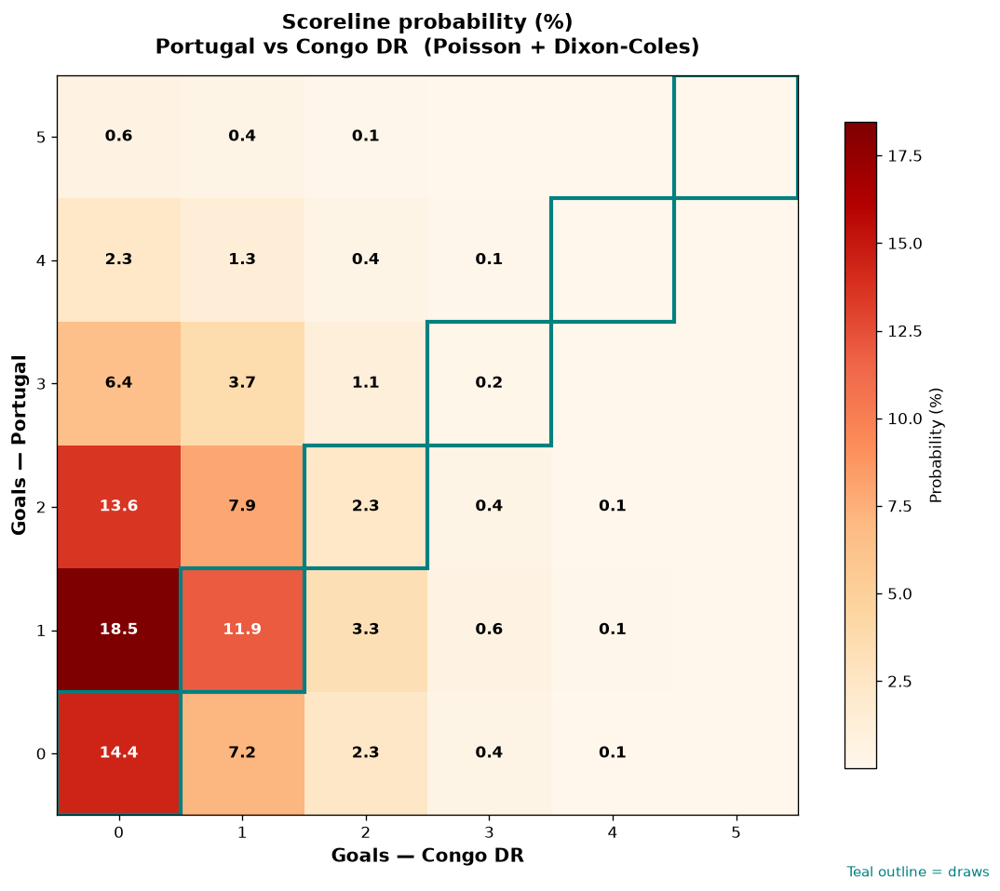

# Portugal vs Congo DR — 2026-06-17

*Stage:* group  ·  *Engine:* Poisson bivariate + Dixon-Coles + Monte Carlo

## Expected goals (model)

- **Portugal**: 1.41
- **Congo DR**: 0.58
- **Total**: 1.99  ·  rho = -0.0668

## 1X2 (match result)

| Outcome | Model |
|---|---|
| Portugal win | **56.6%** |
| Draw | **28.8%** |
| Congo DR win | **14.6%** |

*Monte Carlo (50,000 sims):* 56.8% / 28.6% / 14.6% · avg goals 2.00

## Most likely scorelines

- 1-0: 18.5%
- 0-0: 14.4%
- 2-0: 13.6%
- 1-1: 11.9%
- 2-1: 7.9%
- 0-1: 7.2%

## Derived markets

- Both teams to score: 34.1%
- Over 2.5 goals: 32.2%  ·  Under 2.5: 67.8%
- Double chance 1X: 85.4%  ·  X2: 43.4%

## Scoreline heatmap

---
*Informational model output — not betting advice.*