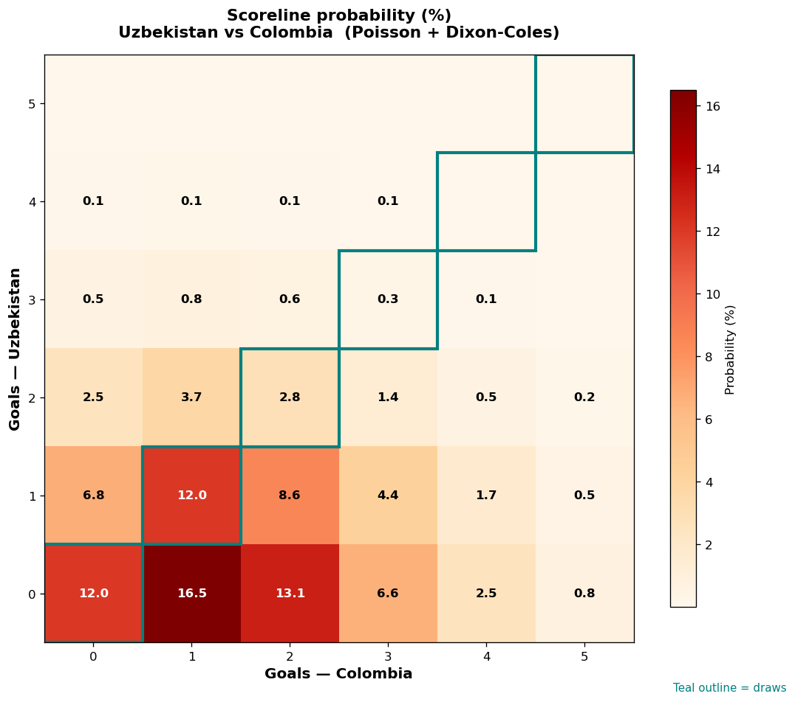

# Uzbekistan vs Colombia — 2026-06-18

*Stage:* group  ·  *Engine:* Poisson bivariate + Dixon-Coles + Monte Carlo

## Expected goals (model)

- **Uzbekistan**: 0.66
- **Colombia**: 1.52
- **Total**: 2.18  ·  rho = -0.0619

## 1X2 (match result)

| Outcome | Model |
|---|---|
| Uzbekistan win | **15.4%** |
| Draw | **27.2%** |
| Colombia win | **57.4%** |

*Monte Carlo (2,000 sims):* 14.9% / 26.2% / 58.8% · avg goals 2.22

## Most likely scorelines

- 0-1: 16.5%
- 0-2: 13.1%
- 1-1: 12.0%
- 0-0: 12.0%
- 1-2: 8.6%
- 1-0: 6.8%

## Derived markets

- Both teams to score: 38.4%
- Over 2.5 goals: 37.2%  ·  Under 2.5: 62.8%
- Double chance 1X: 42.6%  ·  X2: 84.6%

## Scoreline heatmap

---
*Informational model output — not betting advice.*