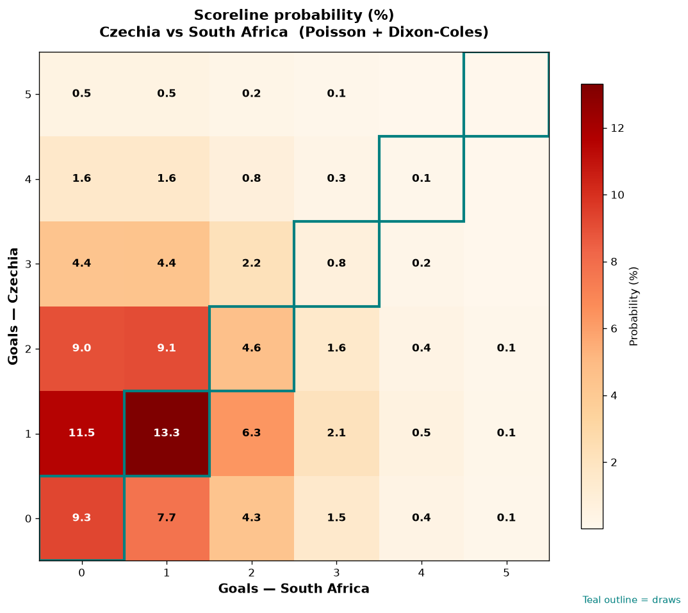

# Czechia vs South Africa — 2026-06-18

*Stage:* group  ·  *Engine:* Poisson bivariate + Dixon-Coles + Monte Carlo

## Expected goals (model)

- **Czechia**: 1.46
- **South Africa**: 1.01
- **Total**: 2.47  ·  rho = -0.0668

## 1X2 (match result)

| Outcome | Model |
|---|---|
| Czechia win | **46.6%** |
| Draw | **28.0%** |
| South Africa win | **25.4%** |

*Monte Carlo (50,000 sims):* 46.6% / 27.9% / 25.5% · avg goals 2.47

## Most likely scorelines

- 1-1: 13.3%
- 1-0: 11.5%
- 0-0: 9.3%
- 2-1: 9.1%
- 2-0: 9.0%
- 0-1: 7.7%

## Derived markets

- Both teams to score: 49.7%
- Over 2.5 goals: 44.8%  ·  Under 2.5: 55.2%
- Double chance 1X: 74.6%  ·  X2: 53.4%

## Scoreline heatmap

---
*Informational model output — not betting advice.*