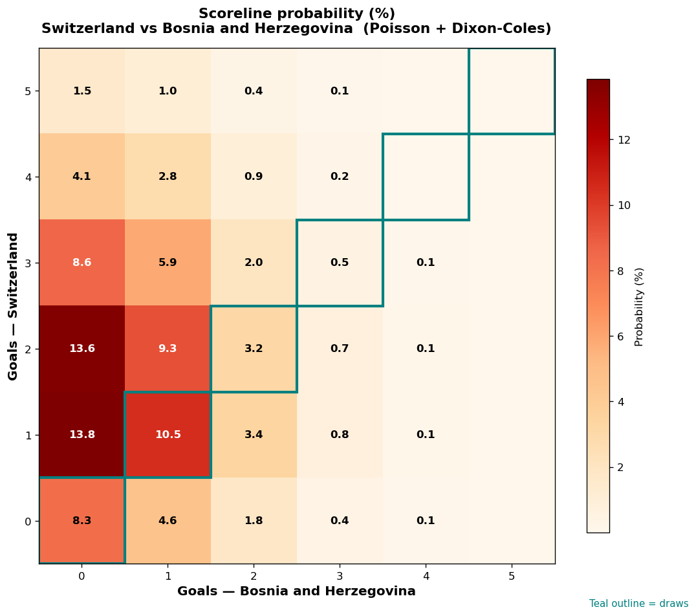

# Switzerland vs Bosnia and Herzegovina — 2026-06-18

*Stage:* group  ·  *Engine:* Poisson bivariate + Dixon-Coles + Monte Carlo

## Expected goals (model)

- **Switzerland**: 1.89
- **Bosnia and Herzegovina**: 0.68
- **Total**: 2.57  ·  rho = -0.0619

## 1X2 (match result)

| Outcome | Model |
|---|---|
| Switzerland win | **65.5%** |
| Draw | **22.4%** |
| Bosnia and Herzegovina win | **12.1%** |

*Monte Carlo (2,000 sims):* 67.0% / 20.0% / 13.0% · avg goals 2.59

## Most likely scorelines

- 1-0: 13.8%
- 2-0: 13.6%
- 1-1: 10.5%
- 2-1: 9.3%
- 3-0: 8.6%
- 0-0: 8.3%

## Derived markets

- Both teams to score: 42.6%
- Over 2.5 goals: 47.4%  ·  Under 2.5: 52.6%
- Double chance 1X: 87.9%  ·  X2: 34.5%

## Scoreline heatmap

---
*Informational model output — not betting advice.*