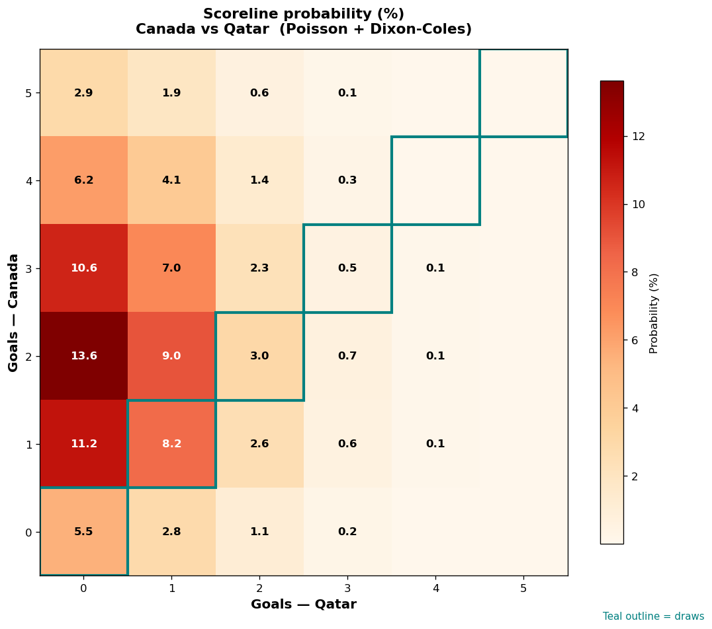

# Canada vs Qatar — 2026-06-18

*Stage:* group  ·  *Engine:* Poisson bivariate + Dixon-Coles + Monte Carlo

## Expected goals (model)

- **Canada**: 2.33
- **Qatar**: 0.66
- **Total**: 3.00  ·  rho = -0.0619

## 1X2 (match result)

| Outcome | Model |
|---|---|
| Canada win | **74.5%** |
| Draw | **17.2%** |
| Qatar win | **8.3%** |

*Monte Carlo (2,000 sims):* 75.4% / 16.5% / 8.1% · avg goals 3.02

## Most likely scorelines

- 2-0: 13.6%
- 1-0: 11.2%
- 3-0: 10.6%
- 2-1: 9.0%
- 1-1: 8.2%
- 3-1: 7.0%

## Derived markets

- Both teams to score: 44.2%
- Over 2.5 goals: 57.6%  ·  Under 2.5: 42.4%
- Double chance 1X: 91.7%  ·  X2: 25.5%

## Scoreline heatmap

---
*Informational model output — not betting advice.*