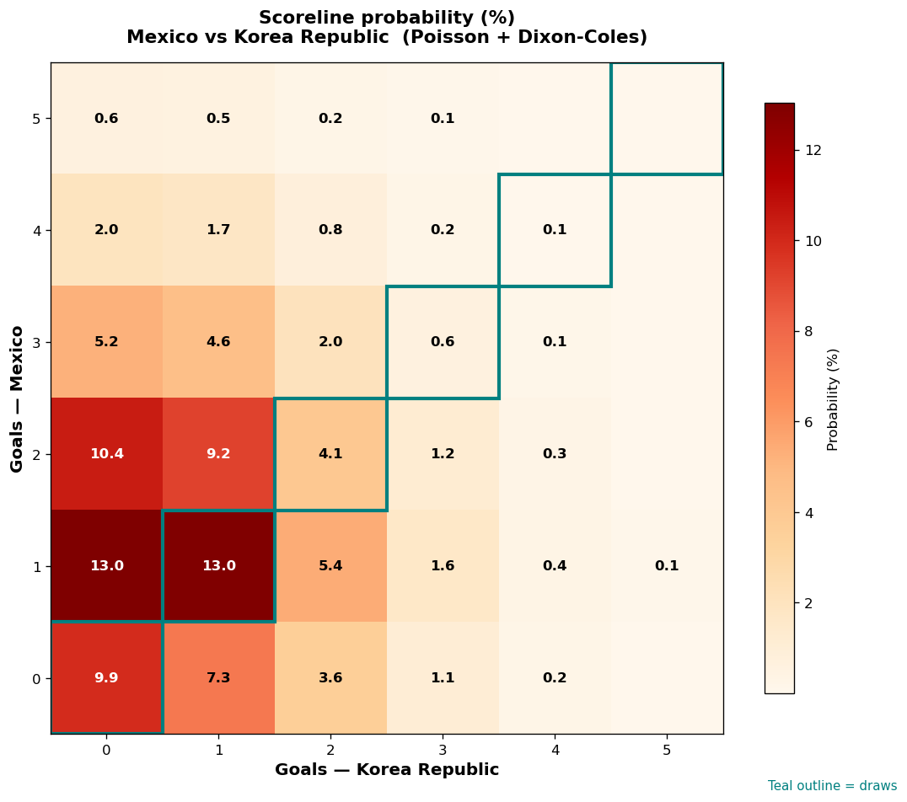

# Mexico vs Korea Republic — 2026-06-19

*Stage:* group  ·  *Engine:* Poisson bivariate + Dixon-Coles + Monte Carlo

## Expected goals (model)

- **Mexico**: 1.51
- **Korea Republic**: 0.88
- **Total**: 2.39  ·  rho = -0.0619

## 1X2 (match result)

| Outcome | Model |
|---|---|
| Mexico win | **51.1%** |
| Draw | **27.6%** |
| Korea Republic win | **21.4%** |

*Monte Carlo (2,000 sims):* 49.7% / 27.8% / 22.6% · avg goals 2.43

## Most likely scorelines

- 1-0: 13.0%
- 1-1: 13.0%
- 2-0: 10.4%
- 0-0: 9.9%
- 2-1: 9.2%
- 0-1: 7.3%

## Derived markets

- Both teams to score: 46.5%
- Over 2.5 goals: 42.8%  ·  Under 2.5: 57.2%
- Double chance 1X: 78.6%  ·  X2: 48.9%

## Scoreline heatmap

---
*Informational model output — not betting advice.*