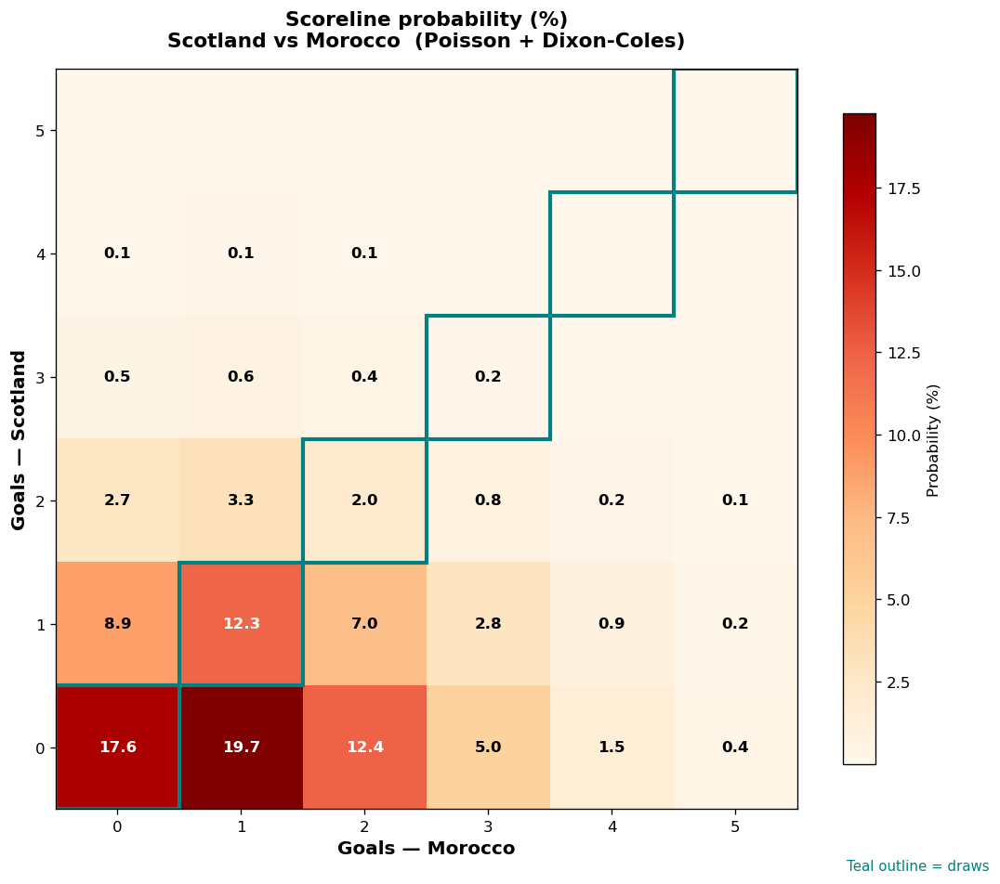

# Scotland vs Morocco — 2026-06-19

*Stage:* group  ·  *Engine:* Poisson bivariate + Dixon-Coles + Monte Carlo

## Expected goals (model)

- **Scotland**: 0.57
- **Morocco**: 1.21
- **Total**: 1.78  ·  rho = -0.0619

## 1X2 (match result)

| Outcome | Model |
|---|---|
| Scotland win | **16.7%** |
| Draw | **32.1%** |
| Morocco win | **51.2%** |

*Monte Carlo (2,000 sims):* 17.2% / 31.4% / 51.4% · avg goals 1.79

## Most likely scorelines

- 0-1: 19.7%
- 0-0: 17.6%
- 0-2: 12.4%
- 1-1: 12.3%
- 1-0: 8.9%
- 1-2: 7.0%

## Derived markets

- Both teams to score: 31.1%
- Over 2.5 goals: 26.3%  ·  Under 2.5: 73.7%
- Double chance 1X: 48.8%  ·  X2: 83.3%

## Scoreline heatmap

---
*Informational model output — not betting advice.*