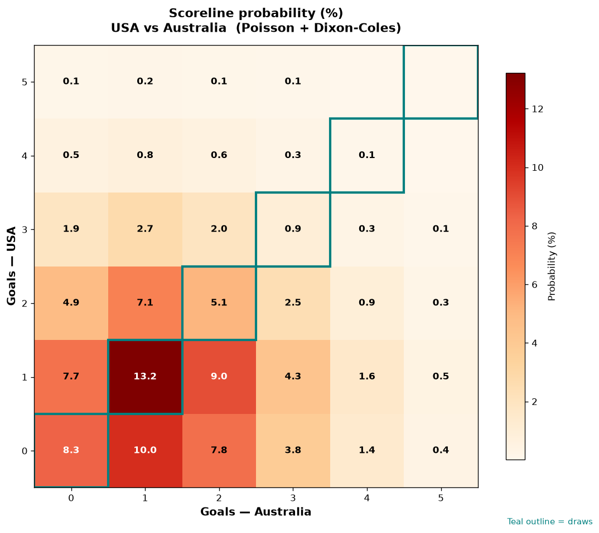

# USA vs Australia — 2026-06-19

*Stage:* group  ·  *Engine:* Poisson bivariate + Dixon-Coles + Monte Carlo

## Expected goals (model)

- **USA**: 1.15
- **Australia**: 1.45
- **Total**: 2.59  ·  rho = -0.067

## 1X2 (match result)

| Outcome | Model |
|---|---|
| USA win | **29.1%** |
| Draw | **27.7%** |
| Australia win | **43.2%** |

*Monte Carlo (50,000 sims):* 29.1% / 27.7% / 43.2% · avg goals 2.60

## Most likely scorelines

- 1-1: 13.2%
- 0-1: 10.0%
- 1-2: 9.0%
- 0-0: 8.3%
- 0-2: 7.8%
- 1-0: 7.7%

## Derived markets

- Both teams to score: 53.0%
- Over 2.5 goals: 48.0%  ·  Under 2.5: 52.0%
- Double chance 1X: 56.8%  ·  X2: 70.9%

## Scoreline heatmap

---
*Informational model output — not betting advice.*