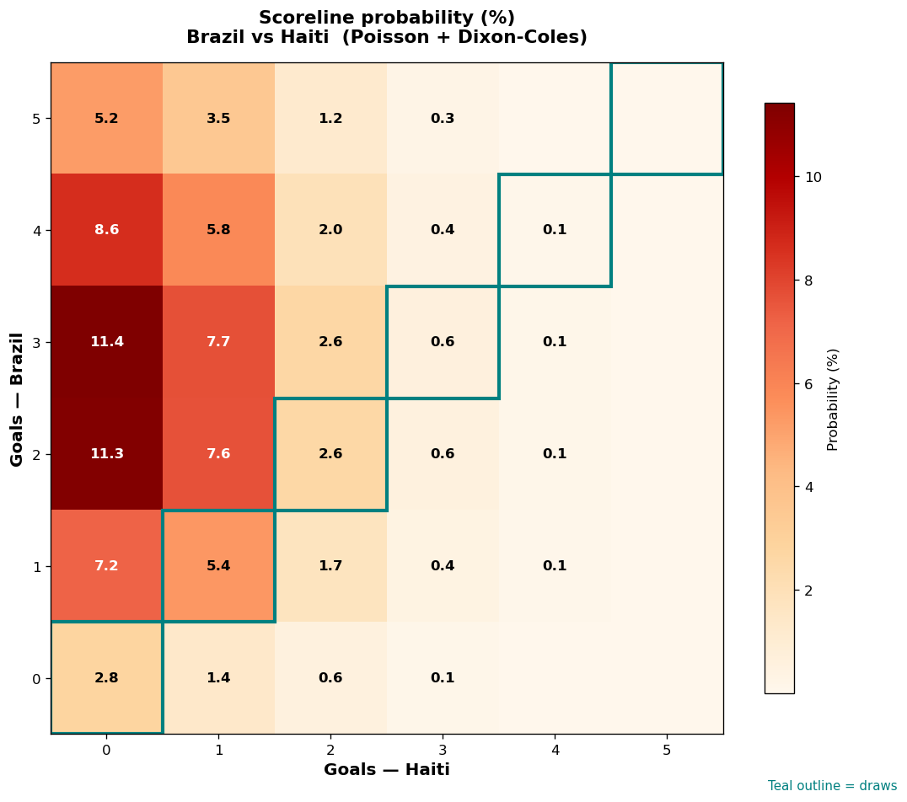

# Brazil vs Haiti — 2026-06-20

*Stage:* group  ·  *Engine:* Poisson bivariate + Dixon-Coles + Monte Carlo

## Expected goals (model)

- **Brazil**: 3.02
- **Haiti**: 0.67
- **Total**: 3.70  ·  rho = -0.0619

## 1X2 (match result)

| Outcome | Model |
|---|---|
| Brazil win | **83.6%** |
| Draw | **11.4%** |
| Haiti win | **5.0%** |

*Monte Carlo (2,000 sims):* 82.8% / 12.0% / 5.1% · avg goals 3.73

## Most likely scorelines

- 3-0: 11.4%
- 2-0: 11.3%
- 4-0: 8.6%
- 3-1: 7.7%
- 2-1: 7.6%
- 1-0: 7.2%

## Derived markets

- Both teams to score: 47.0%
- Over 2.5 goals: 71.4%  ·  Under 2.5: 28.6%
- Double chance 1X: 95.0%  ·  X2: 16.4%

## Scoreline heatmap

---
*Informational model output — not betting advice.*