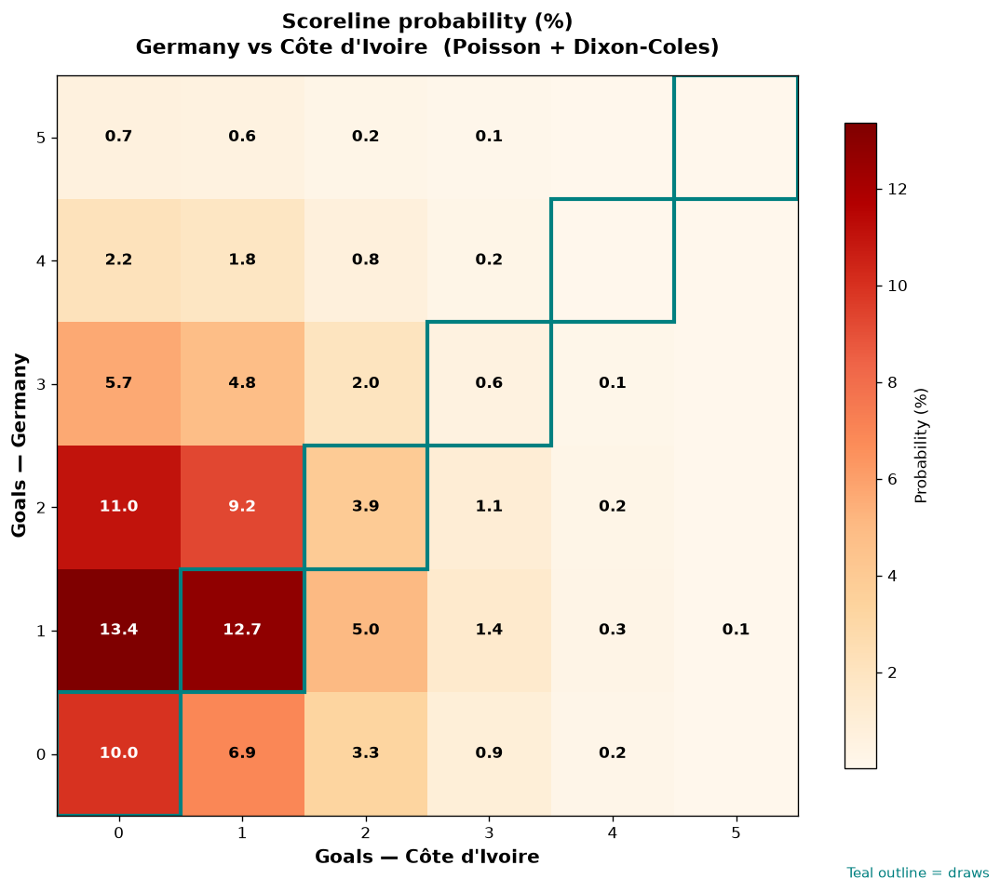

# Germany vs Côte d'Ivoire — 2026-06-20

*Stage:* group  ·  *Engine:* Poisson bivariate + Dixon-Coles + Monte Carlo

## Expected goals (model)

- **Germany**: 1.55
- **Côte d'Ivoire**: 0.84
- **Total**: 2.39  ·  rho = -0.0672

## 1X2 (match result)

| Outcome | Model |
|---|---|
| Germany win | **53.1%** |
| Draw | **27.2%** |
| Côte d'Ivoire win | **19.6%** |

*Monte Carlo (50,000 sims):* 53.2% / 26.9% / 20.0% · avg goals 2.40

## Most likely scorelines

- 1-0: 13.4%
- 1-1: 12.7%
- 2-0: 11.0%
- 0-0: 10.0%
- 2-1: 9.2%
- 0-1: 6.9%

## Derived markets

- Both teams to score: 45.6%
- Over 2.5 goals: 42.8%  ·  Under 2.5: 57.2%
- Double chance 1X: 80.4%  ·  X2: 46.9%

## Scoreline heatmap

---
*Informational model output — not betting advice.*