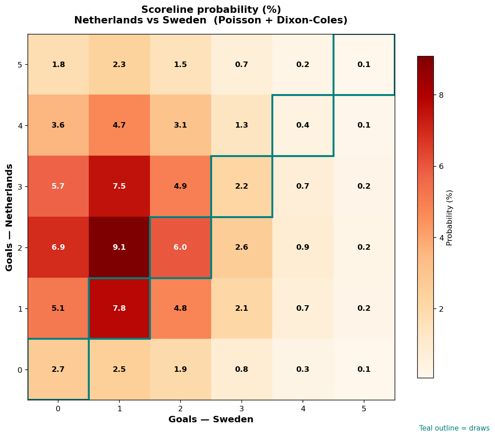

# Netherlands vs Sweden — 2026-06-20

*Stage:* group  ·  *Engine:* Poisson bivariate + Dixon-Coles + Monte Carlo

## Expected goals (model)

- **Netherlands**: 2.49
- **Sweden**: 1.31
- **Total**: 3.80  ·  rho = -0.0619

## 1X2 (match result)

| Outcome | Model |
|---|---|
| Netherlands win | **62.6%** |
| Draw | **19.1%** |
| Sweden win | **18.3%** |

*Monte Carlo (2,000 sims):* 62.3% / 20.6% / 17.1% · avg goals 3.82

## Most likely scorelines

- 2-1: 9.1%
- 1-1: 7.8%
- 3-1: 7.5%
- 2-0: 6.9%
- 2-2: 6.0%
- 3-0: 5.7%

## Derived markets

- Both teams to score: 67.5%
- Over 2.5 goals: 73.1%  ·  Under 2.5: 26.9%
- Double chance 1X: 81.7%  ·  X2: 37.4%

## Scoreline heatmap

---
*Informational model output — not betting advice.*