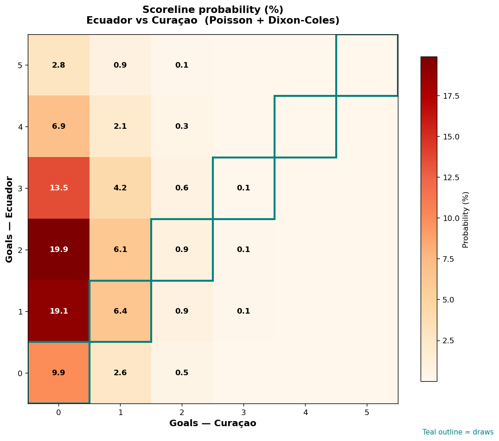

# Ecuador vs Curaçao — 2026-06-21

*Stage:* group  ·  *Engine:* Poisson bivariate + Dixon-Coles + Monte Carlo

## Expected goals (model)

- **Ecuador**: 2.04
- **Curaçao**: 0.31
- **Total**: 2.35  ·  rho = -0.0619

## 1X2 (match result)

| Outcome | Model |
|---|---|
| Ecuador win | **78.5%** |
| Draw | **17.3%** |
| Curaçao win | **4.2%** |

*Monte Carlo (2,000 sims):* 79.8% / 15.7% / 4.5% · avg goals 2.38

## Most likely scorelines

- 2-0: 19.9%
- 1-0: 19.1%
- 3-0: 13.5%
- 0-0: 9.9%
- 4-0: 6.9%
- 1-1: 6.4%

## Derived markets

- Both teams to score: 23.5%
- Over 2.5 goals: 41.7%  ·  Under 2.5: 58.3%
- Double chance 1X: 95.8%  ·  X2: 21.5%

## Scoreline heatmap

---
*Informational model output — not betting advice.*