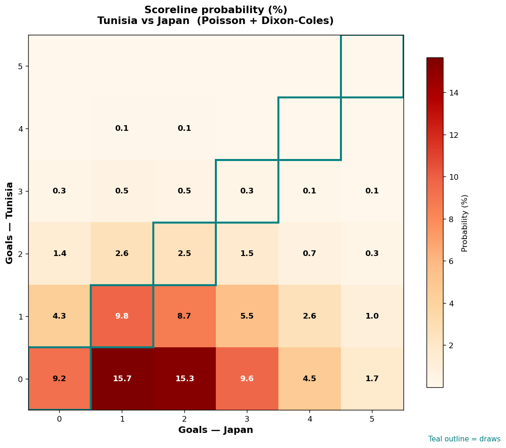

# Tunisia vs Japan — 2026-06-21

*Stage:* group  ·  *Engine:* Poisson bivariate + Dixon-Coles + Monte Carlo

## Expected goals (model)

- **Tunisia**: 0.57
- **Japan**: 1.88
- **Total**: 2.45  ·  rho = -0.0619

## 1X2 (match result)

| Outcome | Model |
|---|---|
| Tunisia win | **9.8%** |
| Draw | **21.7%** |
| Japan win | **68.5%** |

*Monte Carlo (2,000 sims):* 10.0% / 20.3% / 69.7% · avg goals 2.48

## Most likely scorelines

- 0-1: 15.7%
- 0-2: 15.3%
- 1-1: 9.8%
- 0-3: 9.6%
- 0-0: 9.2%
- 1-2: 8.7%

## Derived markets

- Both teams to score: 37.3%
- Over 2.5 goals: 44.4%  ·  Under 2.5: 55.6%
- Double chance 1X: 31.5%  ·  X2: 90.2%

## Scoreline heatmap

---
*Informational model output — not betting advice.*