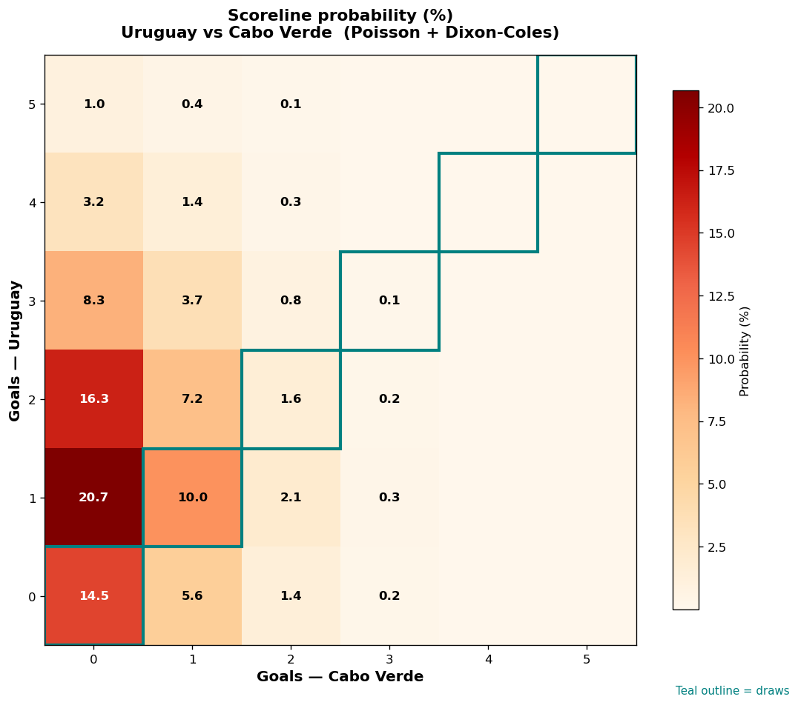

# Uruguay vs Cabo Verde — 2026-06-21

*Stage:* group  ·  *Engine:* Poisson bivariate + Dixon-Coles + Monte Carlo

## Expected goals (model)

- **Uruguay**: 1.53
- **Cabo Verde**: 0.44
- **Total**: 1.97  ·  rho = -0.0619

## 1X2 (match result)

| Outcome | Model |
|---|---|
| Uruguay win | **63.9%** |
| Draw | **26.2%** |
| Cabo Verde win | **9.9%** |

*Monte Carlo (2,000 sims):* 62.9% / 27.0% / 10.1% · avg goals 2.01

## Most likely scorelines

- 1-0: 20.7%
- 2-0: 16.3%
- 0-0: 14.5%
- 1-1: 10.0%
- 3-0: 8.3%
- 2-1: 7.2%

## Derived markets

- Both teams to score: 28.7%
- Over 2.5 goals: 31.6%  ·  Under 2.5: 68.4%
- Double chance 1X: 90.1%  ·  X2: 36.1%

## Scoreline heatmap

---
*Informational model output — not betting advice.*