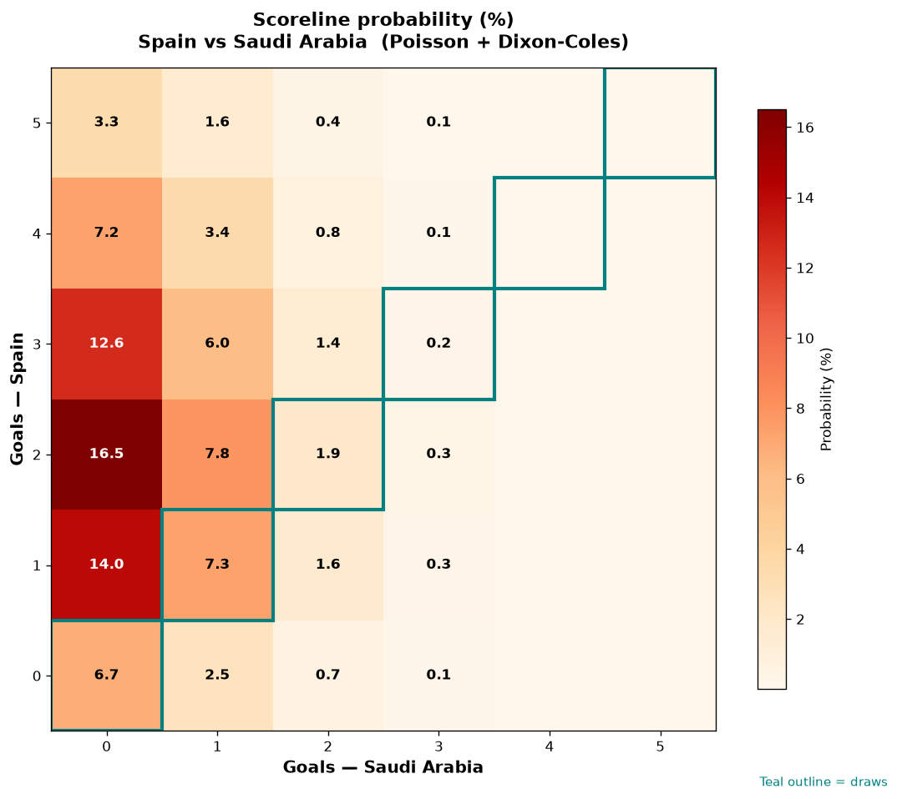

# Spain vs Saudi Arabia — 2026-06-21

*Stage:* group  ·  *Engine:* Poisson bivariate + Dixon-Coles + Monte Carlo

## Expected goals (model)

- **Spain**: 2.30
- **Saudi Arabia**: 0.47
- **Total**: 2.77  ·  rho = -0.0645

## 1X2 (match result)

| Outcome | Model |
|---|---|
| Spain win | **78.3%** |
| Draw | **16.1%** |
| Saudi Arabia win | **5.6%** |

*Monte Carlo (50,000 sims):* 78.5% / 16.0% / 5.6% · avg goals 2.77

## Most likely scorelines

- 2-0: 16.5%
- 1-0: 14.0%
- 3-0: 12.6%
- 2-1: 7.8%
- 1-1: 7.3%
- 4-0: 7.2%

## Derived markets

- Both teams to score: 34.4%
- Over 2.5 goals: 52.3%  ·  Under 2.5: 47.7%
- Double chance 1X: 94.4%  ·  X2: 21.7%

## Scoreline heatmap

---
*Informational model output — not betting advice.*