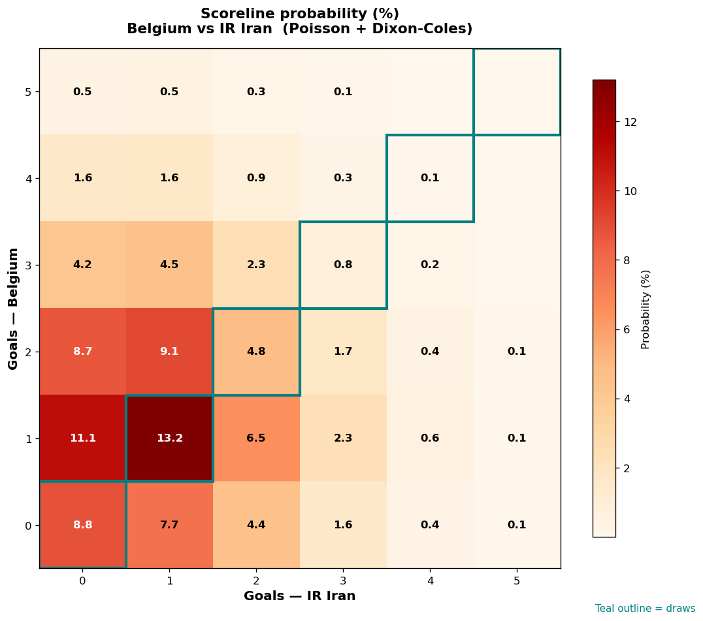

# Belgium vs IR Iran — 2026-06-21

*Stage:* group  ·  *Engine:* Poisson bivariate + Dixon-Coles + Monte Carlo

## Expected goals (model)

- **Belgium**: 1.47
- **IR Iran**: 1.05
- **Total**: 2.52  ·  rho = -0.0619

## 1X2 (match result)

| Outcome | Model |
|---|---|
| Belgium win | **46.0%** |
| Draw | **27.7%** |
| IR Iran win | **26.3%** |

*Monte Carlo (2,000 sims):* 44.8% / 27.2% / 28.0% · avg goals 2.56

## Most likely scorelines

- 1-1: 13.2%
- 1-0: 11.1%
- 2-1: 9.1%
- 0-0: 8.8%
- 2-0: 8.7%
- 0-1: 7.7%

## Derived markets

- Both teams to score: 50.8%
- Over 2.5 goals: 46.1%  ·  Under 2.5: 53.9%
- Double chance 1X: 73.7%  ·  X2: 54.0%

## Scoreline heatmap

---
*Informational model output — not betting advice.*