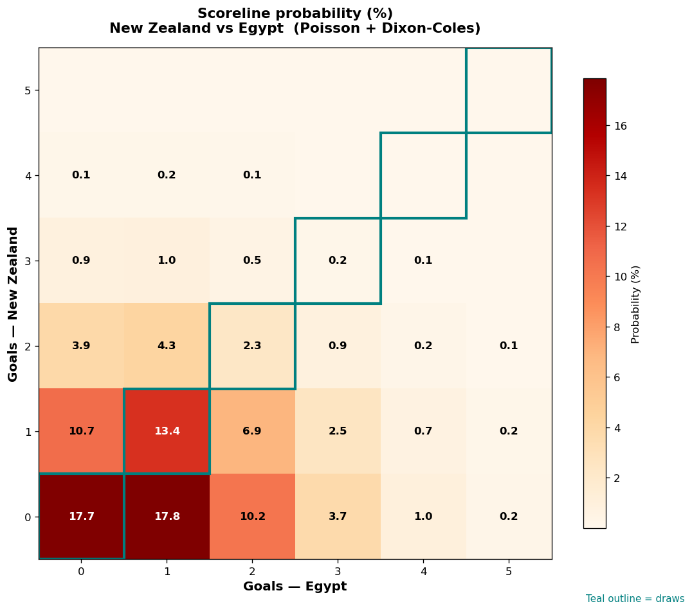

# New Zealand vs Egypt — 2026-06-22

*Stage:* group  ·  *Engine:* Poisson bivariate + Dixon-Coles + Monte Carlo

## Expected goals (model)

- **New Zealand**: 0.68
- **Egypt**: 1.10
- **Total**: 1.77  ·  rho = -0.0619

## 1X2 (match result)

| Outcome | Model |
|---|---|
| New Zealand win | **21.7%** |
| Draw | **33.7%** |
| Egypt win | **44.7%** |

*Monte Carlo (2,000 sims):* 21.2% / 33.1% / 45.6% · avg goals 1.82

## Most likely scorelines

- 0-1: 17.8%
- 0-0: 17.7%
- 1-1: 13.4%
- 1-0: 10.7%
- 0-2: 10.2%
- 1-2: 6.9%

## Derived markets

- Both teams to score: 33.5%
- Over 2.5 goals: 26.2%  ·  Under 2.5: 73.8%
- Double chance 1X: 55.3%  ·  X2: 78.3%

## Scoreline heatmap

---
*Informational model output — not betting advice.*