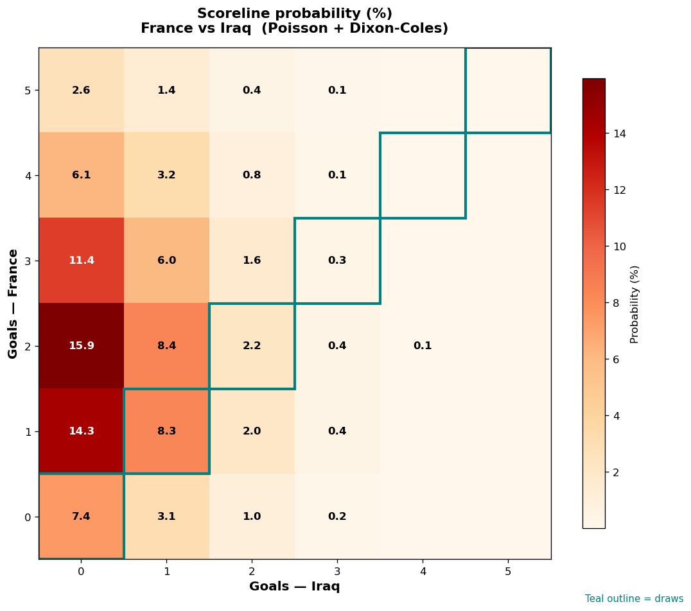

# France vs Iraq — 2026-06-22

*Stage:* group  ·  *Engine:* Poisson bivariate + Dixon-Coles + Monte Carlo

## Expected goals (model)

- **France**: 2.15
- **Iraq**: 0.53
- **Total**: 2.67  ·  rho = -0.0673

## 1X2 (match result)

| Outcome | Model |
|---|---|
| France win | **74.5%** |
| Draw | **18.3%** |
| Iraq win | **7.2%** |

*Monte Carlo (50,000 sims):* 74.6% / 18.3% / 7.1% · avg goals 2.67

## Most likely scorelines

- 2-0: 15.9%
- 1-0: 14.3%
- 3-0: 11.4%
- 2-1: 8.4%
- 1-1: 8.3%
- 0-0: 7.4%

## Derived markets

- Both teams to score: 36.6%
- Over 2.5 goals: 49.9%  ·  Under 2.5: 50.1%
- Double chance 1X: 92.8%  ·  X2: 25.5%

## Scoreline heatmap

---
*Informational model output — not betting advice.*