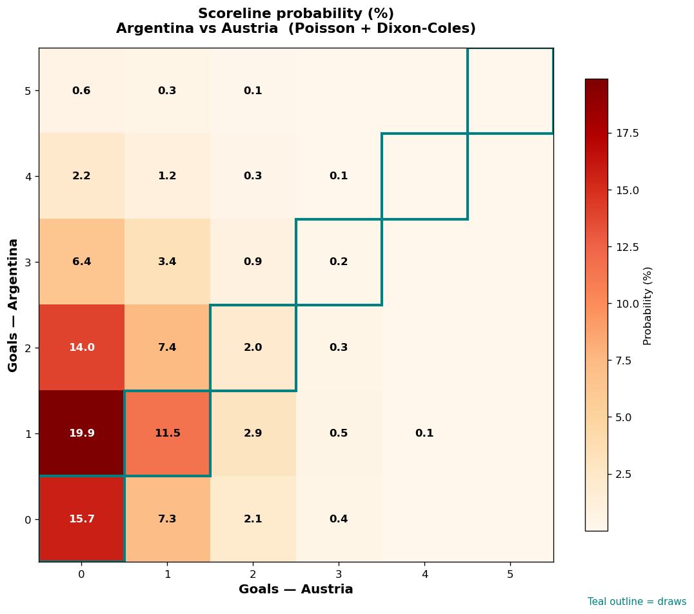

# Argentina vs Austria — 2026-06-22

*Stage:* group  ·  *Engine:* Poisson bivariate + Dixon-Coles + Monte Carlo

## Expected goals (model)

- **Argentina**: 1.37
- **Austria**: 0.53
- **Total**: 1.90  ·  rho = -0.0619

## 1X2 (match result)

| Outcome | Model |
|---|---|
| Argentina win | **56.9%** |
| Draw | **29.4%** |
| Austria win | **13.7%** |

*Monte Carlo (2,000 sims):* 56.1% / 30.1% / 13.7% · avg goals 1.92

## Most likely scorelines

- 1-0: 19.9%
- 0-0: 15.7%
- 2-0: 14.0%
- 1-1: 11.5%
- 2-1: 7.4%
- 0-1: 7.3%

## Derived markets

- Both teams to score: 31.3%
- Over 2.5 goals: 29.5%  ·  Under 2.5: 70.5%
- Double chance 1X: 86.3%  ·  X2: 43.1%

## Scoreline heatmap

---
*Informational model output — not betting advice.*