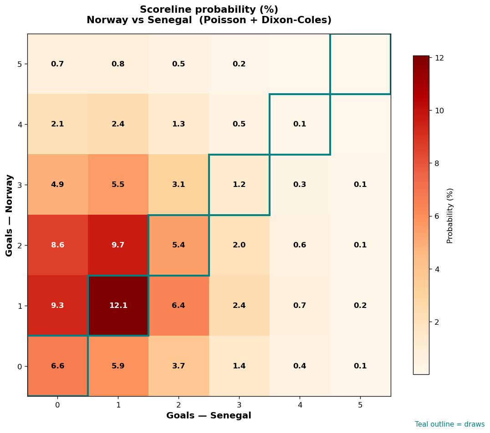

# Norway vs Senegal — 2026-06-23

*Stage:* group  ·  *Engine:* Poisson bivariate + Dixon-Coles + Monte Carlo

## Expected goals (model)

- **Norway**: 1.71
- **Senegal**: 1.12
- **Total**: 2.83  ·  rho = -0.0673

## 1X2 (match result)

| Outcome | Model |
|---|---|
| Norway win | **50.3%** |
| Draw | **25.4%** |
| Senegal win | **24.3%** |

*Monte Carlo (50,000 sims):* 50.7% / 25.1% / 24.2% · avg goals 2.83

## Most likely scorelines

- 1-1: 12.1%
- 2-1: 9.7%
- 1-0: 9.3%
- 2-0: 8.6%
- 0-0: 6.6%
- 1-2: 6.4%

## Derived markets

- Both teams to score: 56.0%
- Over 2.5 goals: 53.8%  ·  Under 2.5: 46.2%
- Double chance 1X: 75.7%  ·  X2: 49.7%

## Scoreline heatmap

---
*Informational model output — not betting advice.*