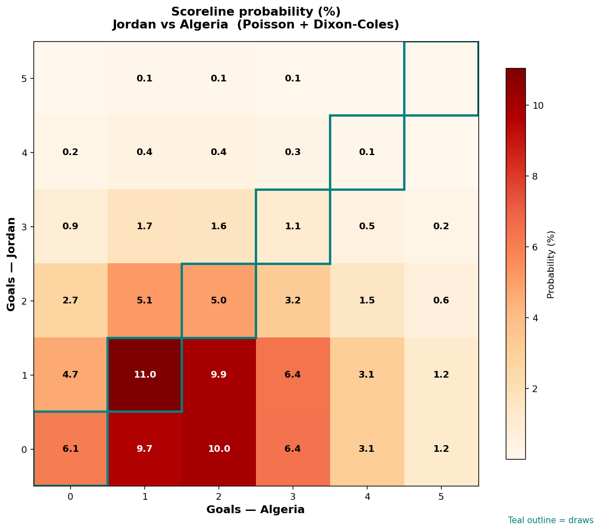

# Jordan vs Algeria — 2026-06-23

*Stage:* group  ·  *Engine:* Poisson bivariate + Dixon-Coles + Monte Carlo

## Expected goals (model)

- **Jordan**: 1.00
- **Algeria**: 1.92
- **Total**: 2.92  ·  rho = -0.0673

## 1X2 (match result)

| Outcome | Model |
|---|---|
| Jordan win | **18.4%** |
| Draw | **23.3%** |
| Algeria win | **58.3%** |

*Monte Carlo (50,000 sims):* 18.6% / 23.2% / 58.2% · avg goals 2.92

## Most likely scorelines

- 1-1: 11.0%
- 0-2: 10.0%
- 1-2: 9.9%
- 0-1: 9.7%
- 0-3: 6.4%
- 1-3: 6.4%

## Derived markets

- Both teams to score: 54.6%
- Over 2.5 goals: 55.9%  ·  Under 2.5: 44.1%
- Double chance 1X: 41.7%  ·  X2: 81.6%

## Scoreline heatmap

---
*Informational model output — not betting advice.*