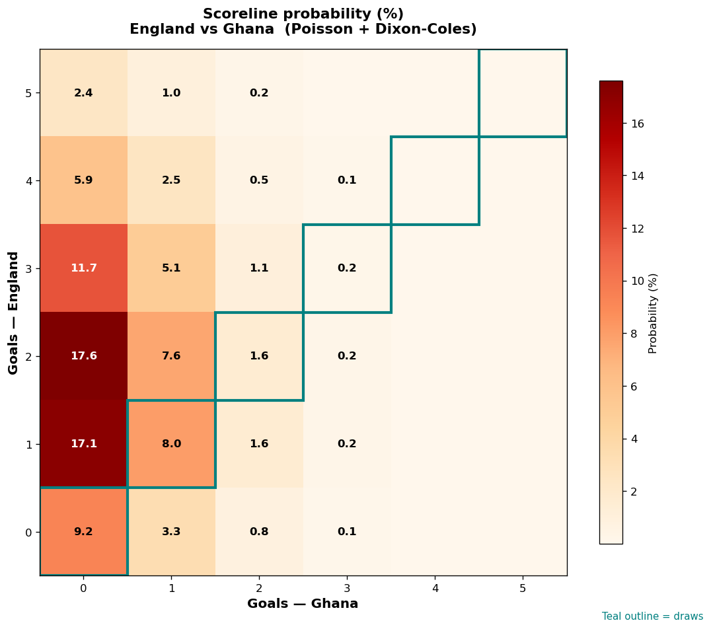

# England vs Ghana — 2026-06-23

*Stage:* group  ·  *Engine:* Poisson bivariate + Dixon-Coles + Monte Carlo

## Expected goals (model)

- **England**: 2.00
- **Ghana**: 0.43
- **Total**: 2.43  ·  rho = -0.0619

## 1X2 (match result)

| Outcome | Model |
|---|---|
| England win | **74.5%** |
| Draw | **19.1%** |
| Ghana win | **6.4%** |

*Monte Carlo (2,000 sims):* 75.5% / 17.1% / 7.4% · avg goals 2.48

## Most likely scorelines

- 2-0: 17.6%
- 1-0: 17.1%
- 3-0: 11.7%
- 0-0: 9.2%
- 1-1: 8.0%
- 2-1: 7.6%

## Derived markets

- Both teams to score: 30.7%
- Over 2.5 goals: 43.9%  ·  Under 2.5: 56.1%
- Double chance 1X: 93.6%  ·  X2: 25.5%

## Scoreline heatmap

---
*Informational model output — not betting advice.*