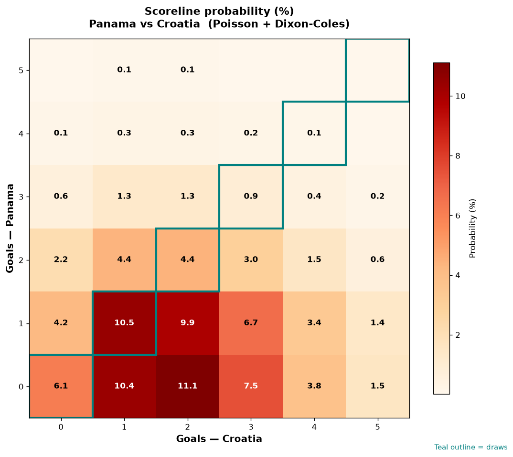

# Panama vs Croatia — 2026-06-23

*Stage:* group  ·  *Engine:* Poisson bivariate + Dixon-Coles + Monte Carlo

## Expected goals (model)

- **Panama**: 0.89
- **Croatia**: 2.02
- **Total**: 2.91  ·  rho = -0.0673

## 1X2 (match result)

| Outcome | Model |
|---|---|
| Panama win | **15.1%** |
| Draw | **21.9%** |
| Croatia win | **63.0%** |

*Monte Carlo (50,000 sims):* 15.3% / 21.9% / 62.8% · avg goals 2.90

## Most likely scorelines

- 0-2: 11.1%
- 1-1: 10.5%
- 0-1: 10.4%
- 1-2: 9.9%
- 0-3: 7.5%
- 1-3: 6.7%

## Derived markets

- Both teams to score: 51.7%
- Over 2.5 goals: 55.6%  ·  Under 2.5: 44.4%
- Double chance 1X: 37.0%  ·  X2: 84.9%

## Scoreline heatmap

---
*Informational model output — not betting advice.*