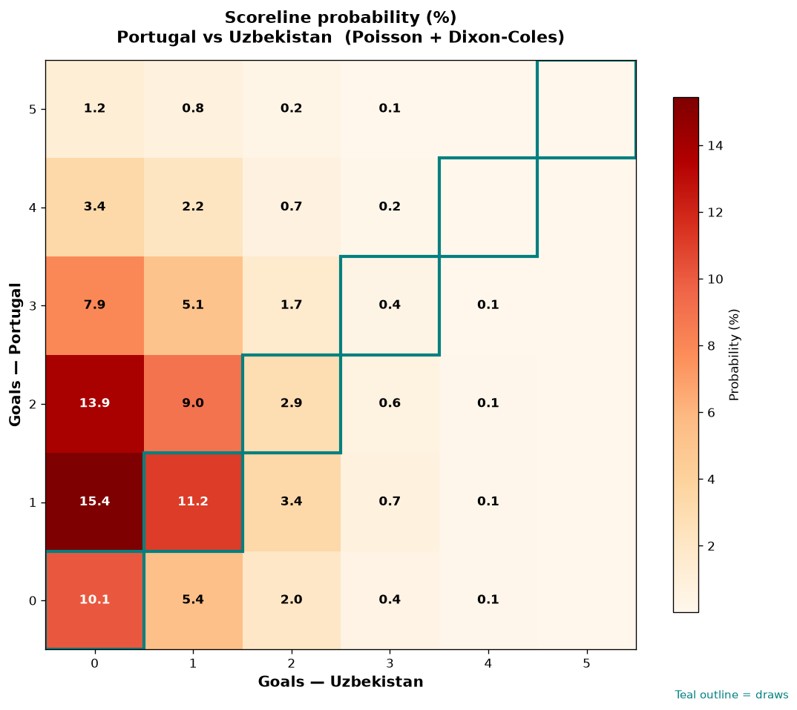

# Portugal vs Uzbekistan — 2026-06-23

*Stage:* group  ·  *Engine:* Poisson bivariate + Dixon-Coles + Monte Carlo

## Expected goals (model)

- **Portugal**: 1.72
- **Uzbekistan**: 0.65
- **Total**: 2.36  ·  rho = -0.0673

## 1X2 (match result)

| Outcome | Model |
|---|---|
| Portugal win | **62.5%** |
| Draw | **24.6%** |
| Uzbekistan win | **12.9%** |

*Monte Carlo (50,000 sims):* 62.7% / 24.4% / 12.9% · avg goals 2.36

## Most likely scorelines

- 1-0: 15.4%
- 2-0: 13.9%
- 1-1: 11.2%
- 0-0: 10.1%
- 2-1: 9.0%
- 3-0: 7.9%

## Derived markets

- Both teams to score: 39.8%
- Over 2.5 goals: 42.1%  ·  Under 2.5: 57.9%
- Double chance 1X: 87.1%  ·  X2: 37.5%

## Scoreline heatmap

---
*Informational model output — not betting advice.*