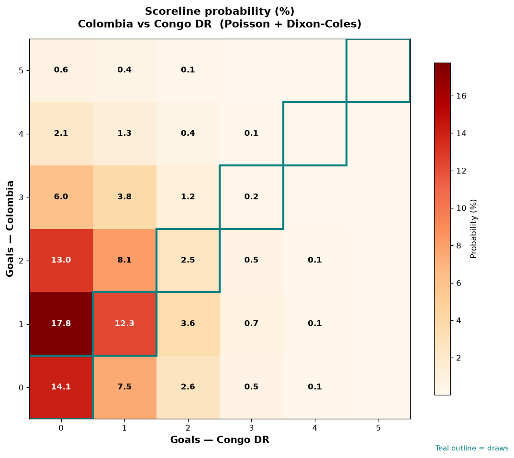

# Colombia vs Congo DR — 2026-06-24

*Stage:* group  ·  *Engine:* Poisson bivariate + Dixon-Coles + Monte Carlo

## Expected goals (model)

- **Colombia**: 1.40
- **Congo DR**: 0.62
- **Total**: 2.02  ·  rho = -0.0675

## 1X2 (match result)

| Outcome | Model |
|---|---|
| Colombia win | **55.1%** |
| Draw | **29.1%** |
| Congo DR win | **15.8%** |

*Monte Carlo (50,000 sims):* 55.2% / 29.0% / 15.8% · avg goals 2.02

## Most likely scorelines

- 1-0: 17.8%
- 0-0: 14.1%
- 2-0: 13.0%
- 1-1: 12.3%
- 2-1: 8.1%
- 0-1: 7.5%

## Derived markets

- Both teams to score: 35.6%
- Over 2.5 goals: 32.9%  ·  Under 2.5: 67.1%
- Double chance 1X: 84.2%  ·  X2: 44.9%

## Scoreline heatmap

---
*Informational model output — not betting advice.*