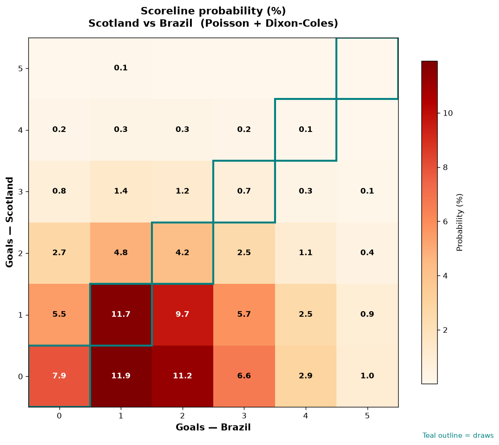

# Scotland vs Brazil — 2026-06-24

*Stage:* group  ·  *Engine:* Poisson bivariate + Dixon-Coles + Monte Carlo

## Expected goals (model)

- **Scotland**: 0.87
- **Brazil**: 1.77
- **Total**: 2.64  ·  rho = -0.0676

## 1X2 (match result)

| Outcome | Model |
|---|---|
| Scotland win | **17.4%** |
| Draw | **24.6%** |
| Brazil win | **58.0%** |

*Monte Carlo (50,000 sims):* 17.3% / 24.5% / 58.2% · avg goals 2.64

## Most likely scorelines

- 0-1: 11.9%
- 1-1: 11.7%
- 0-2: 11.2%
- 1-2: 9.7%
- 0-0: 7.9%
- 0-3: 6.6%

## Derived markets

- Both teams to score: 48.9%
- Over 2.5 goals: 49.1%  ·  Under 2.5: 50.9%
- Double chance 1X: 42.0%  ·  X2: 82.6%

## Scoreline heatmap

---
*Informational model output — not betting advice.*