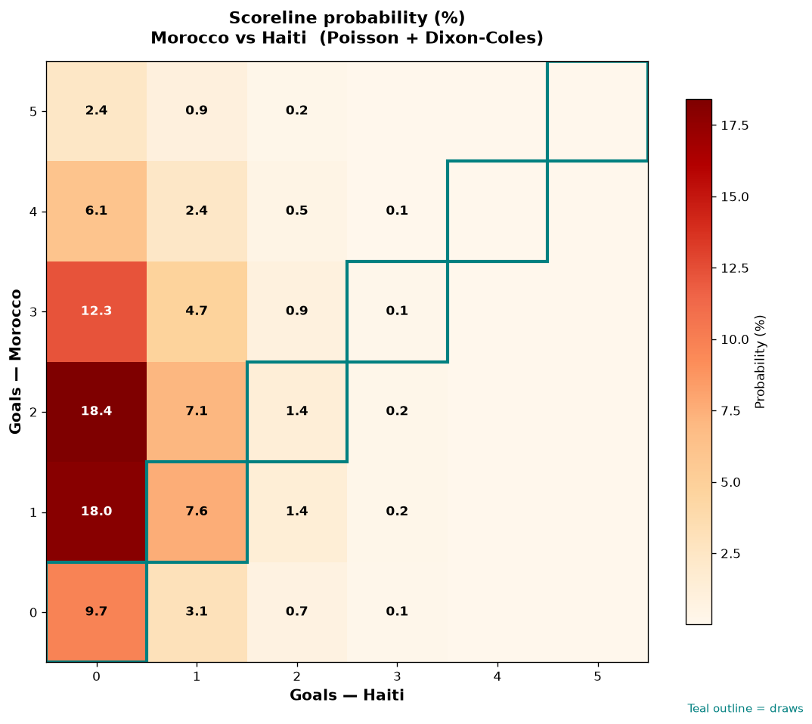

# Morocco vs Haiti — 2026-06-24

*Stage:* group  ·  *Engine:* Poisson bivariate + Dixon-Coles + Monte Carlo

## Expected goals (model)

- **Morocco**: 2.00
- **Haiti**: 0.38
- **Total**: 2.38  ·  rho = -0.0675

## 1X2 (match result)

| Outcome | Model |
|---|---|
| Morocco win | **75.6%** |
| Draw | **18.8%** |
| Haiti win | **5.6%** |

*Monte Carlo (50,000 sims):* 75.8% / 18.5% / 5.7% · avg goals 2.38

## Most likely scorelines

- 2-0: 18.4%
- 1-0: 18.0%
- 3-0: 12.3%
- 0-0: 9.7%
- 1-1: 7.6%
- 2-1: 7.1%

## Derived markets

- Both teams to score: 28.1%
- Over 2.5 goals: 42.5%  ·  Under 2.5: 57.5%
- Double chance 1X: 94.4%  ·  X2: 24.4%

## Scoreline heatmap

---
*Informational model output — not betting advice.*