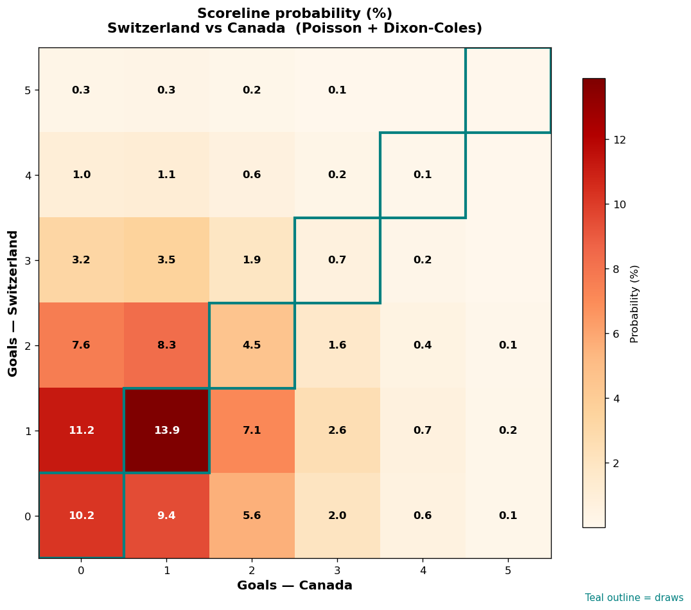

# Switzerland vs Canada — 2026-06-24

*Stage:* group  ·  *Engine:* Poisson bivariate + Dixon-Coles + Monte Carlo

## Expected goals (model)

- **Switzerland**: 1.27
- **Canada**: 1.09
- **Total**: 2.36  ·  rho = -0.0619

## 1X2 (match result)

| Outcome | Model |
|---|---|
| Switzerland win | **39.8%** |
| Draw | **29.4%** |
| Canada win | **30.9%** |

*Monte Carlo (2,000 sims):* 38.4% / 29.6% / 31.9% · avg goals 2.40

## Most likely scorelines

- 1-1: 13.9%
- 1-0: 11.2%
- 0-0: 10.2%
- 0-1: 9.4%
- 2-1: 8.3%
- 2-0: 7.6%

## Derived markets

- Both teams to score: 48.6%
- Over 2.5 goals: 42.1%  ·  Under 2.5: 57.9%
- Double chance 1X: 69.1%  ·  X2: 60.2%

## Scoreline heatmap

---
*Informational model output — not betting advice.*