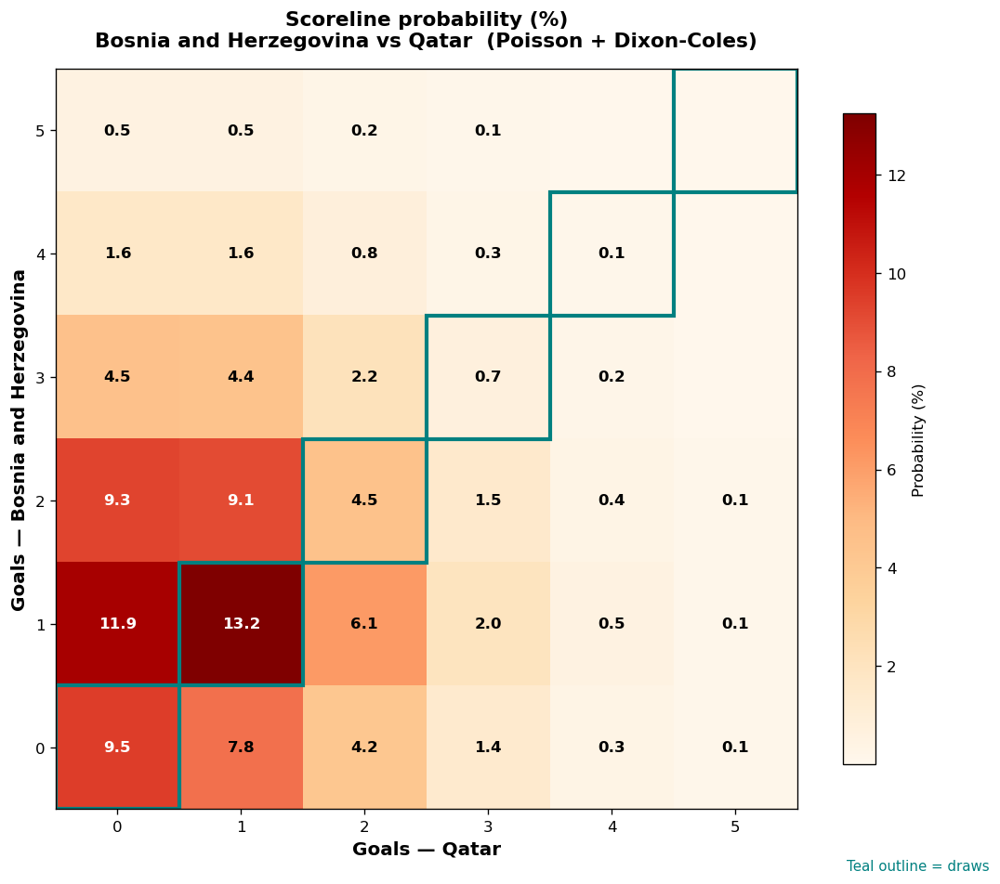

# Bosnia and Herzegovina vs Qatar — 2026-06-24

*Stage:* group  ·  *Engine:* Poisson bivariate + Dixon-Coles + Monte Carlo

## Expected goals (model)

- **Bosnia and Herzegovina**: 1.46
- **Qatar**: 0.98
- **Total**: 2.44  ·  rho = -0.0619

## 1X2 (match result)

| Outcome | Model |
|---|---|
| Bosnia and Herzegovina win | **47.4%** |
| Draw | **28.0%** |
| Qatar win | **24.6%** |

*Monte Carlo (2,000 sims):* 46.5% / 28.3% / 25.1% · avg goals 2.46

## Most likely scorelines

- 1-1: 13.2%
- 1-0: 11.9%
- 0-0: 9.5%
- 2-0: 9.3%
- 2-1: 9.1%
- 0-1: 7.8%

## Derived markets

- Both teams to score: 48.8%
- Over 2.5 goals: 44.1%  ·  Under 2.5: 55.9%
- Double chance 1X: 75.4%  ·  X2: 52.6%

## Scoreline heatmap

---
*Informational model output — not betting advice.*