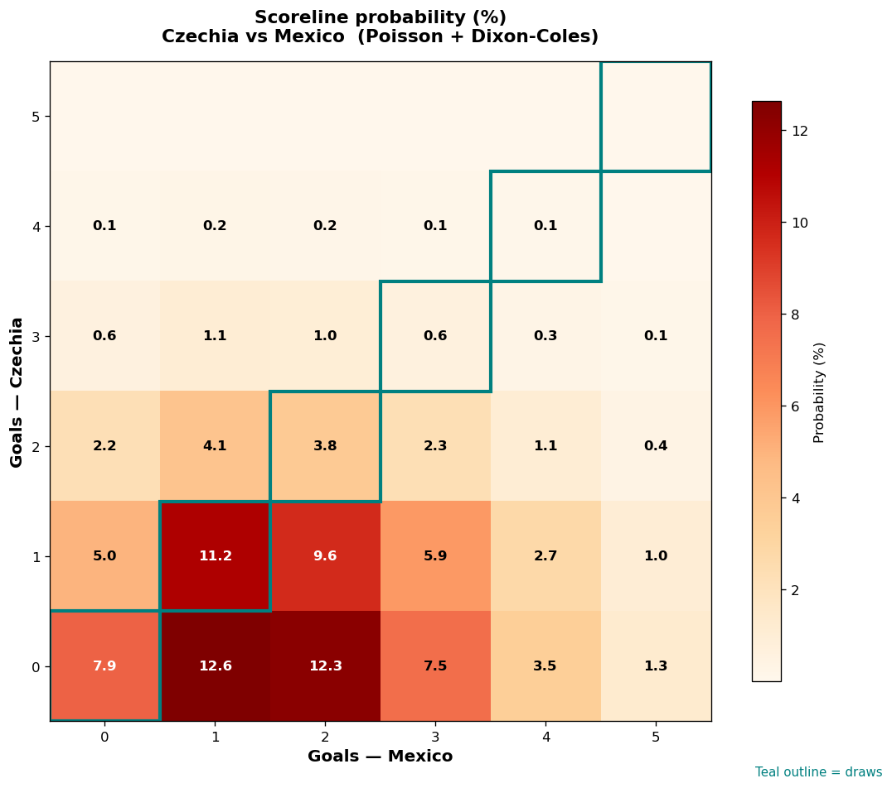

# Czechia vs Mexico — 2026-06-25

*Stage:* group  ·  *Engine:* Poisson bivariate + Dixon-Coles + Monte Carlo

## Expected goals (model)

- **Czechia**: 0.78
- **Mexico**: 1.84
- **Total**: 2.63  ·  rho = -0.0673

## 1X2 (match result)

| Outcome | Model |
|---|---|
| Czechia win | **14.7%** |
| Draw | **23.5%** |
| Mexico win | **61.8%** |

*Monte Carlo (50,000 sims):* 14.6% / 23.5% / 61.9% · avg goals 2.63

## Most likely scorelines

- 0-1: 12.6%
- 0-2: 12.3%
- 1-1: 11.2%
- 1-2: 9.6%
- 0-0: 7.9%
- 0-3: 7.5%

## Derived markets

- Both teams to score: 46.4%
- Over 2.5 goals: 48.8%  ·  Under 2.5: 51.2%
- Double chance 1X: 38.2%  ·  X2: 85.3%

## Scoreline heatmap

---
*Informational model output — not betting advice.*