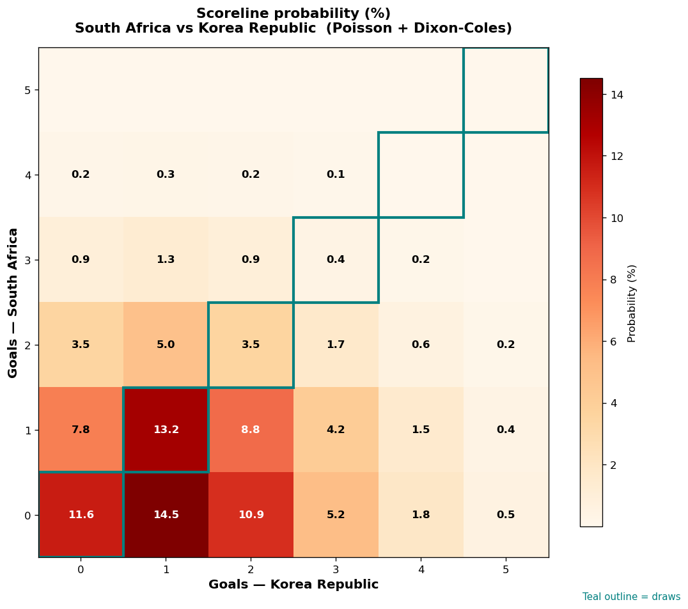

# South Africa vs Korea Republic — 2026-06-25

*Stage:* group  ·  *Engine:* Poisson bivariate + Dixon-Coles + Monte Carlo

## Expected goals (model)

- **South Africa**: 0.80
- **Korea Republic**: 1.42
- **Total**: 2.23  ·  rho = -0.0673

## 1X2 (match result)

| Outcome | Model |
|---|---|
| South Africa win | **20.4%** |
| Draw | **28.8%** |
| Korea Republic win | **50.8%** |

*Monte Carlo (50,000 sims):* 20.4% / 28.7% / 50.9% · avg goals 2.23

## Most likely scorelines

- 0-1: 14.5%
- 1-1: 13.2%
- 0-0: 11.6%
- 0-2: 10.9%
- 1-2: 8.8%
- 1-0: 7.8%

## Derived markets

- Both teams to score: 42.8%
- Over 2.5 goals: 38.5%  ·  Under 2.5: 61.5%
- Double chance 1X: 49.2%  ·  X2: 79.6%

## Scoreline heatmap

---
*Informational model output — not betting advice.*