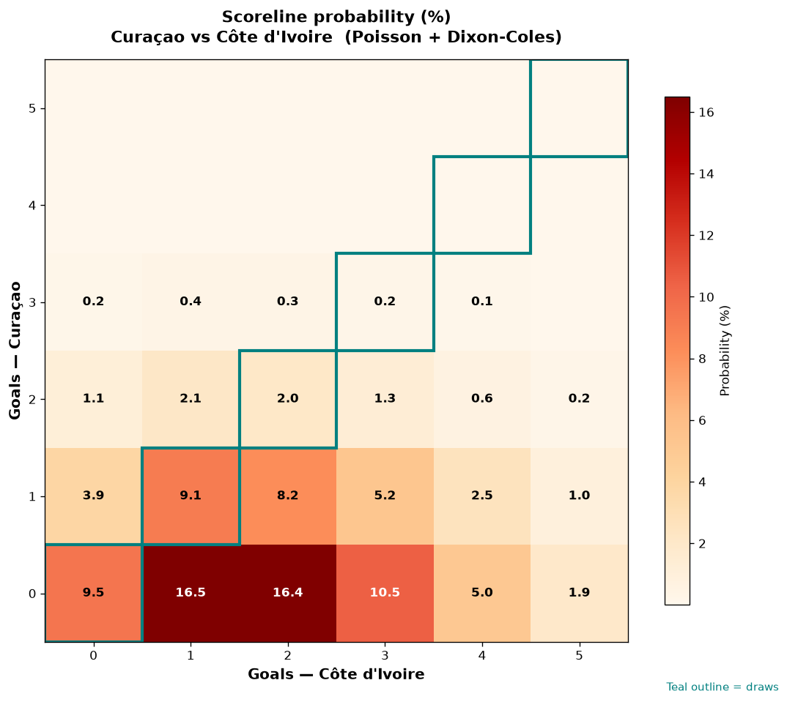

# Curaçao vs Côte d'Ivoire — 2026-06-25

*Stage:* group  ·  *Engine:* Poisson bivariate + Dixon-Coles + Monte Carlo

## Expected goals (model)

- **Curaçao**: 0.50
- **Côte d'Ivoire**: 1.92
- **Total**: 2.42  ·  rho = -0.0676

## 1X2 (match result)

| Outcome | Model |
|---|---|
| Curaçao win | **8.1%** |
| Draw | **20.8%** |
| Côte d'Ivoire win | **71.0%** |

*Monte Carlo (50,000 sims):* 8.2% / 20.9% / 71.0% · avg goals 2.42

## Most likely scorelines

- 0-1: 16.5%
- 0-2: 16.4%
- 0-3: 10.5%
- 0-0: 9.5%
- 1-1: 9.1%
- 1-2: 8.2%

## Derived markets

- Both teams to score: 34.1%
- Over 2.5 goals: 43.6%  ·  Under 2.5: 56.4%
- Double chance 1X: 29.0%  ·  X2: 91.9%

## Scoreline heatmap

---
*Informational model output — not betting advice.*