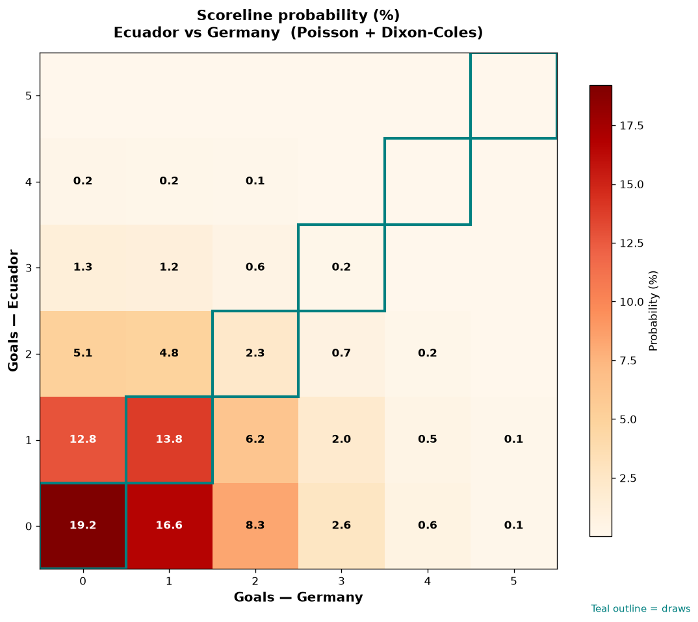

# Ecuador vs Germany — 2026-06-25

*Stage:* group  ·  *Engine:* Poisson bivariate + Dixon-Coles + Monte Carlo

## Expected goals (model)

- **Ecuador**: 0.74
- **Germany**: 0.95
- **Total**: 1.69  ·  rho = -0.065

## 1X2 (match result)

| Outcome | Model |
|---|---|
| Ecuador win | **26.4%** |
| Draw | **35.5%** |
| Germany win | **38.0%** |

*Monte Carlo (50,000 sims):* 26.4% / 35.7% / 37.9% · avg goals 1.69

## Most likely scorelines

- 0-0: 19.2%
- 0-1: 16.6%
- 1-1: 13.8%
- 1-0: 12.8%
- 0-2: 8.3%
- 1-2: 6.2%

## Derived markets

- Both teams to score: 33.0%
- Over 2.5 goals: 24.1%  ·  Under 2.5: 75.9%
- Double chance 1X: 62.0%  ·  X2: 73.6%

## Scoreline heatmap

---
*Informational model output — not betting advice.*