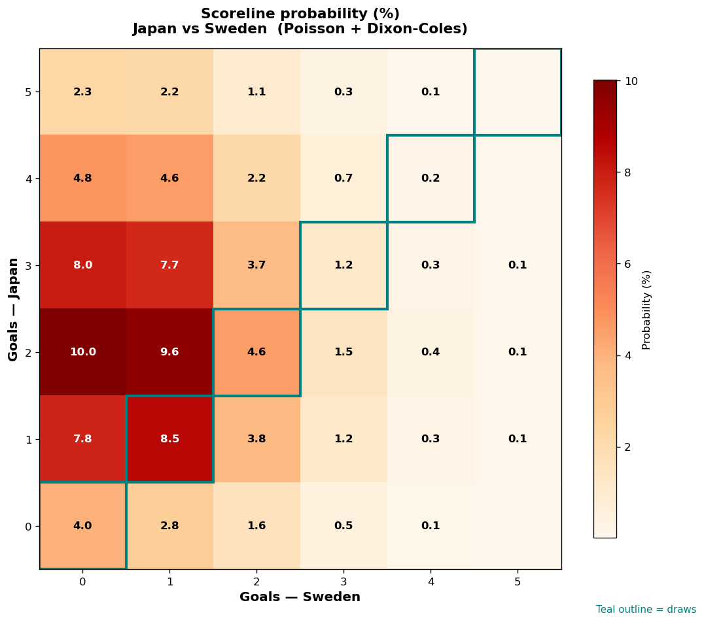

# Japan vs Sweden — 2026-06-25

*Stage:* group  ·  *Engine:* Poisson bivariate + Dixon-Coles + Monte Carlo

## Expected goals (model)

- **Japan**: 2.40
- **Sweden**: 0.96
- **Total**: 3.36  ·  rho = -0.0673

## 1X2 (match result)

| Outcome | Model |
|---|---|
| Japan win | **68.8%** |
| Draw | **18.5%** |
| Sweden win | **12.7%** |

*Monte Carlo (50,000 sims):* 68.9% / 18.5% / 12.6% · avg goals 3.36

## Most likely scorelines

- 2-0: 10.0%
- 2-1: 9.6%
- 1-1: 8.5%
- 3-0: 8.0%
- 1-0: 7.8%
- 3-1: 7.7%

## Derived markets

- Both teams to score: 56.6%
- Over 2.5 goals: 65.3%  ·  Under 2.5: 34.7%
- Double chance 1X: 87.3%  ·  X2: 31.2%

## Scoreline heatmap

---
*Informational model output — not betting advice.*