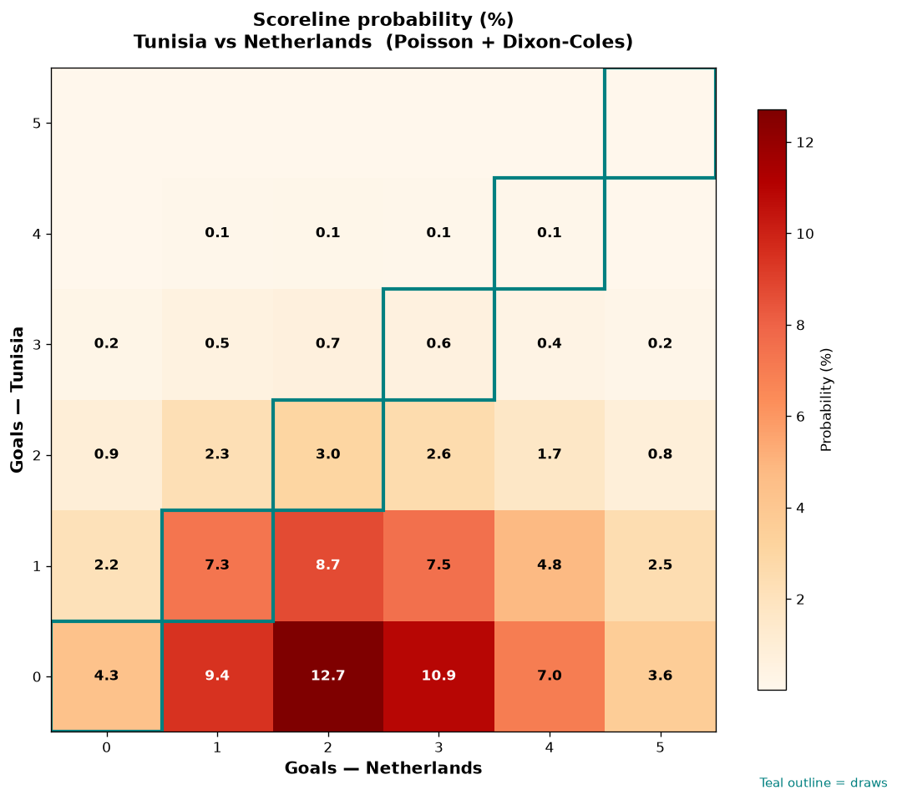

# Tunisia vs Netherlands — 2026-06-25

*Stage:* group  ·  *Engine:* Poisson bivariate + Dixon-Coles + Monte Carlo

## Expected goals (model)

- **Tunisia**: 0.69
- **Netherlands**: 2.57
- **Total**: 3.26  ·  rho = -0.0675

## 1X2 (match result)

| Outcome | Model |
|---|---|
| Tunisia win | **7.3%** |
| Draw | **15.2%** |
| Netherlands win | **77.5%** |

*Monte Carlo (50,000 sims):* 7.4% / 15.0% / 77.6% · avg goals 3.26

## Most likely scorelines

- 0-2: 12.7%
- 0-3: 10.9%
- 0-1: 9.4%
- 1-2: 8.7%
- 1-3: 7.5%
- 1-1: 7.3%

## Derived markets

- Both teams to score: 46.4%
- Over 2.5 goals: 63.2%  ·  Under 2.5: 36.8%
- Double chance 1X: 22.5%  ·  X2: 92.7%

## Scoreline heatmap

---
*Informational model output — not betting advice.*