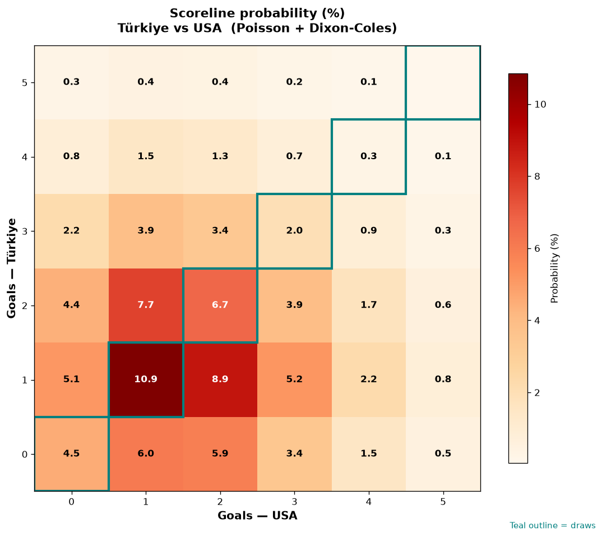

# Türkiye vs USA — 2026-06-26

*Stage:* group  ·  *Engine:* Poisson bivariate + Dixon-Coles + Monte Carlo

## Expected goals (model)

- **Türkiye**: 1.51
- **USA**: 1.74
- **Total**: 3.25  ·  rho = -0.0673

## 1X2 (match result)

| Outcome | Model |
|---|---|
| Türkiye win | **32.8%** |
| Draw | **24.4%** |
| USA win | **42.8%** |

*Monte Carlo (50,000 sims):* 32.9% / 24.3% / 42.8% · avg goals 3.26

## Most likely scorelines

- 1-1: 10.9%
- 1-2: 8.9%
- 2-1: 7.7%
- 2-2: 6.7%
- 0-1: 6.0%
- 0-2: 5.9%

## Derived markets

- Both teams to score: 65.0%
- Over 2.5 goals: 63.1%  ·  Under 2.5: 36.9%
- Double chance 1X: 57.2%  ·  X2: 67.2%

## Scoreline heatmap

---
*Informational model output — not betting advice.*