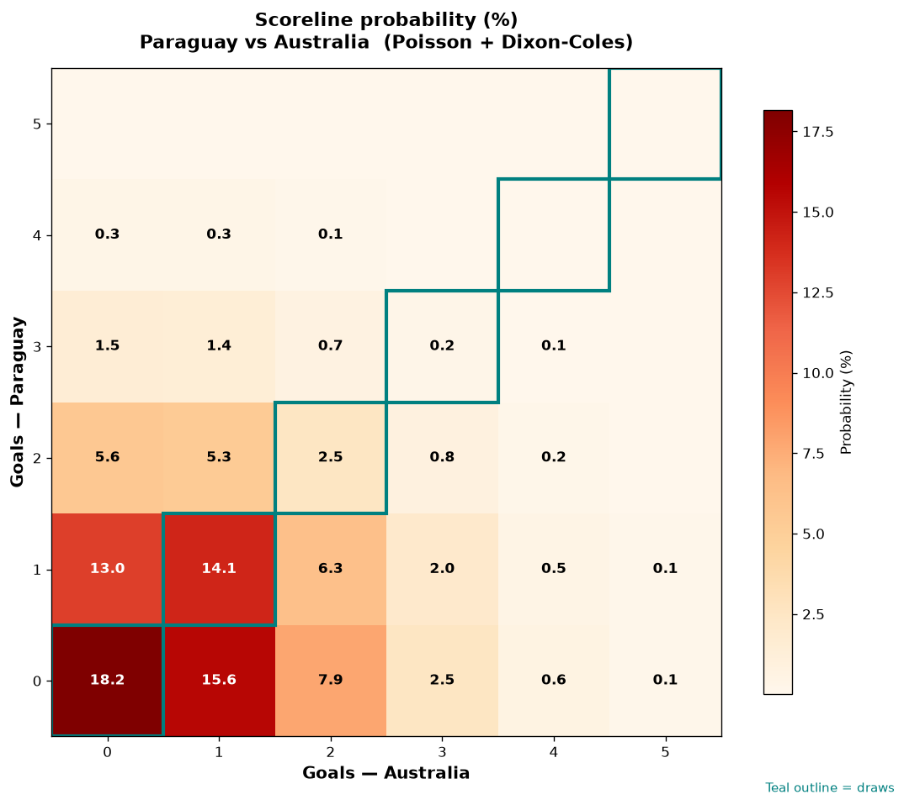

# Paraguay vs Australia — 2026-06-26

*Stage:* group  ·  *Engine:* Poisson bivariate + Dixon-Coles + Monte Carlo

## Expected goals (model)

- **Paraguay**: 0.80
- **Australia**: 0.95
- **Total**: 1.76  ·  rho = -0.0676

## 1X2 (match result)

| Outcome | Model |
|---|---|
| Paraguay win | **28.3%** |
| Draw | **35.0%** |
| Australia win | **36.6%** |

*Monte Carlo (50,000 sims):* 28.2% / 35.2% / 36.6% · avg goals 1.76

## Most likely scorelines

- 0-0: 18.2%
- 0-1: 15.6%
- 1-1: 14.1%
- 1-0: 13.0%
- 0-2: 7.9%
- 1-2: 6.3%

## Derived markets

- Both teams to score: 34.8%
- Over 2.5 goals: 25.8%  ·  Under 2.5: 74.2%
- Double chance 1X: 63.4%  ·  X2: 71.7%

## Scoreline heatmap

---
*Informational model output — not betting advice.*